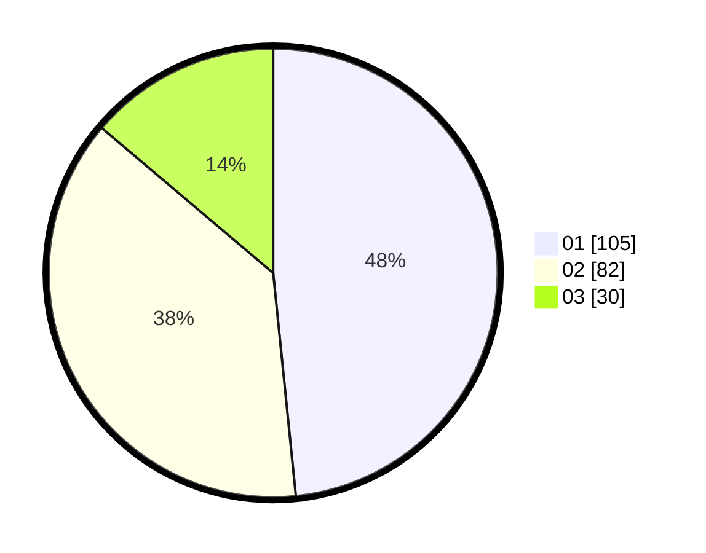

# Hasil

Hasil perolehan suara paslon dapat dilihat pada file paslon-01.txt, paslon-02.txt, dan paslon-03.txt.

Jika tidak ada, artinya data tersebut belum ada pada SIREKAP.

## Perolehan Suara

 * Paslon 01: **105**.
 * Paslon 02: **82**.
 * Paslon 03: **30**.

## Foto C Plano

https://sirekap-obj-formc.kpu.go.id/f8b1/pemilu/ppwp/31/75/07/10/07/3175071007043-20240216-144757--2437e7fc-159b-47d9-b1cd-6a3f3d3d2ee4.jpg

https://sirekap-obj-formc.kpu.go.id/f8b1/pemilu/ppwp/31/75/07/10/07/3175071007043-20240216-144759--c8b48efb-b5bb-45ec-8a6e-1a917203b9e2.jpg

https://sirekap-obj-formc.kpu.go.id/f8b1/pemilu/ppwp/31/75/07/10/07/3175071007043-20240216-175839--799a1906-a367-4bf2-b961-b83fb8517f4d.jpg

## DATA PEMILIH TETAP

Jumlah pemilih dalam DPT: **261**.
 * L: **127**.
 * P: **134**.

## DATA PENGGUNA HAK PILIH

Jumlah pengguna hak pilih dalam DPT: **216**.
 * L: **103**.
 * P: **113**.

Jumlah pengguna hak pilih dalam DPTb: **0**.
 * L: **0**.
 * P: **0**.

Jumlah pengguna hak pilih dalam DPK: **5**.
 * L: **3**.
 * P: **2**.

Jumlah pengguna hak pilih: **221**.
 * L: **106**.
 * P: **115**.

## JUMLAH SUARA SAH DAN TIDAK SAH

JUMLAH SELURUH SUARA SAH: **217**.

JUMLAH SUARA TIDAK SAH: **4**.

JUMLAH SELURUH SUARA SAH DAN SUARA TIDAK SAH: **221**.
