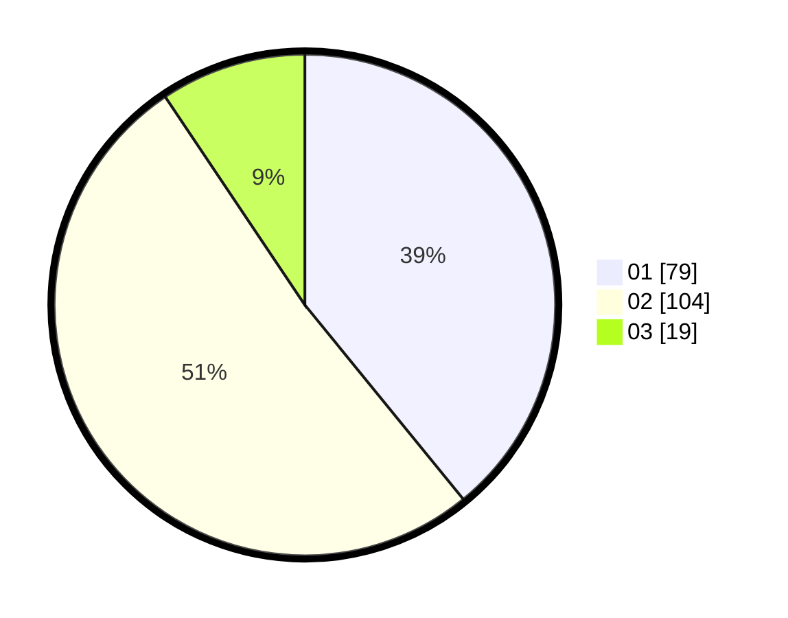

# Hasil

Hasil perolehan suara paslon dapat dilihat pada file paslon-01.txt, paslon-02.txt, dan paslon-03.txt.

Jika tidak ada, artinya data tersebut belum ada pada SIREKAP.

## Perolehan Suara

 * Paslon 01: **79**.
 * Paslon 02: **104**.
 * Paslon 03: **19**.

## Foto C Plano

https://sirekap-obj-formc.kpu.go.id/33f2/pemilu/ppwp/31/75/07/10/07/3175071007047-20240215-213439--1e46398b-99af-437c-92d6-aa180a291b1e.jpg

https://sirekap-obj-formc.kpu.go.id/33f2/pemilu/ppwp/31/75/07/10/07/3175071007047-20240215-213441--77ff38bf-a802-4489-a8eb-6f98e0708e2b.jpg

https://sirekap-obj-formc.kpu.go.id/33f2/pemilu/ppwp/31/75/07/10/07/3175071007047-20240215-213440--7361444e-b9db-422c-8542-256010ac99b2.jpg

## DATA PEMILIH TETAP

Jumlah pemilih dalam DPT: **265**.
 * L: **130**.
 * P: **135**.

## DATA PENGGUNA HAK PILIH

Jumlah pengguna hak pilih dalam DPT: **206**.
 * L: **98**.
 * P: **108**.

Jumlah pengguna hak pilih dalam DPTb: **0**.
 * L: **0**.
 * P: **0**.

Jumlah pengguna hak pilih dalam DPK: **0**.
 * L: **0**.
 * P: **0**.

Jumlah pengguna hak pilih: **206**.
 * L: **98**.
 * P: **108**.

## JUMLAH SUARA SAH DAN TIDAK SAH

JUMLAH SELURUH SUARA SAH: **202**.

JUMLAH SUARA TIDAK SAH: **4**.

JUMLAH SELURUH SUARA SAH DAN SUARA TIDAK SAH: **206**.
