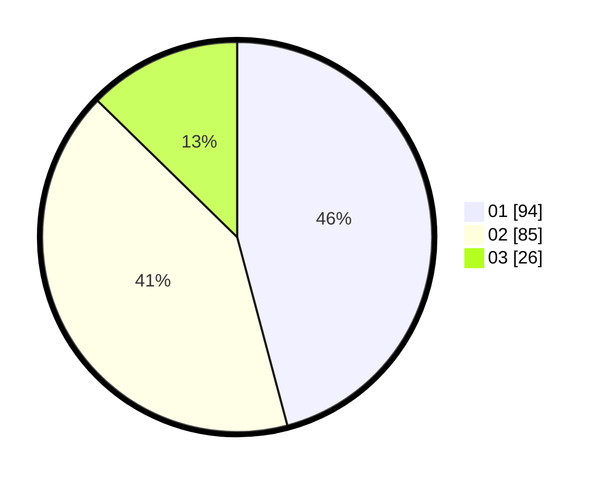

# Hasil

Hasil perolehan suara paslon dapat dilihat pada file paslon-01.txt, paslon-02.txt, dan paslon-03.txt.

Jika tidak ada, artinya data tersebut belum ada pada SIREKAP.

## Perolehan Suara

 * Paslon 01: **94**.
 * Paslon 02: **85**.
 * Paslon 03: **26**.

## Foto C Plano

https://sirekap-obj-formc.kpu.go.id/3f2d/pemilu/ppwp/31/75/07/10/07/3175071007050-20240215-041514--4028a5b6-e700-4fe6-9bad-e94897fd8ff5.jpg

https://sirekap-obj-formc.kpu.go.id/3f2d/pemilu/ppwp/31/75/07/10/07/3175071007050-20240215-041536--5ca25e8d-c22f-451b-8d19-347046f1c67b.jpg

https://sirekap-obj-formc.kpu.go.id/3f2d/pemilu/ppwp/31/75/07/10/07/3175071007050-20240215-041525--ad979efb-b624-4507-8b8b-d9afa819158c.jpg

## DATA PEMILIH TETAP

Jumlah pemilih dalam DPT: **260**.
 * L: **132**.
 * P: **128**.

## DATA PENGGUNA HAK PILIH

Jumlah pengguna hak pilih dalam DPT: **202**.
 * L: **98**.
 * P: **104**.

Jumlah pengguna hak pilih dalam DPTb: **0**.
 * L: **0**.
 * P: **0**.

Jumlah pengguna hak pilih dalam DPK: **6**.
 * L: **2**.
 * P: **4**.

Jumlah pengguna hak pilih: **208**.
 * L: **100**.
 * P: **108**.

## JUMLAH SUARA SAH DAN TIDAK SAH

JUMLAH SELURUH SUARA SAH: **205**.

JUMLAH SUARA TIDAK SAH: **3**.

JUMLAH SELURUH SUARA SAH DAN SUARA TIDAK SAH: **208**.
