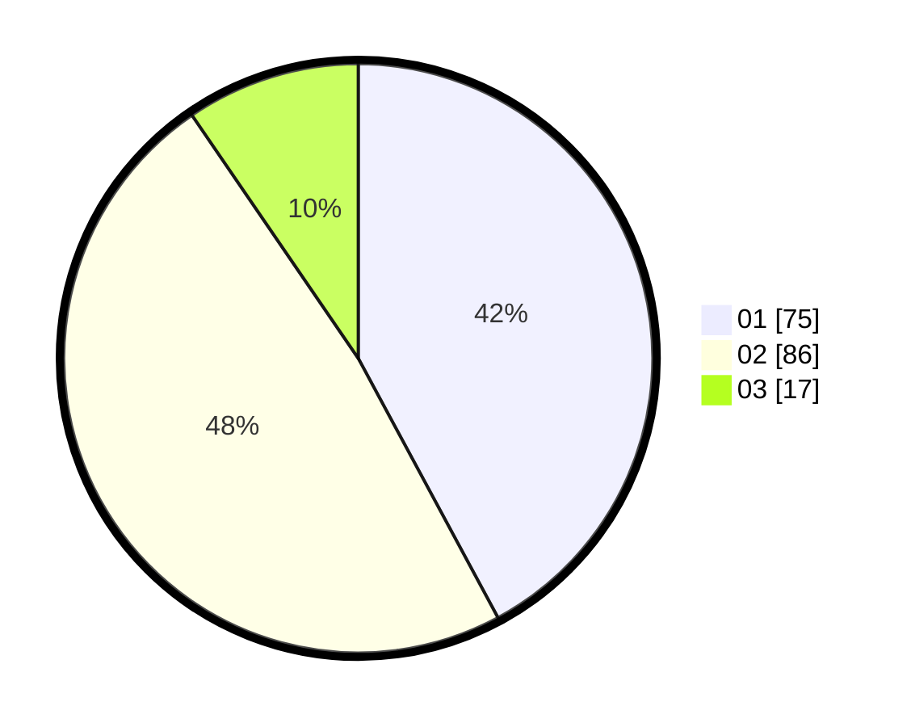

# Hasil

Hasil perolehan suara paslon dapat dilihat pada file paslon-01.txt, paslon-02.txt, dan paslon-03.txt.

Jika tidak ada, artinya data tersebut belum ada pada SIREKAP.

## Perolehan Suara

 * Paslon 01: **75**.
 * Paslon 02: **86**.
 * Paslon 03: **17**.

## Foto C Plano

https://sirekap-obj-formc.kpu.go.id/e3bd/pemilu/ppwp/31/75/07/10/07/3175071007054-20240215-204426--2f06ff2c-b787-4f85-afc3-8776314f8ff1.jpg

https://sirekap-obj-formc.kpu.go.id/e3bd/pemilu/ppwp/31/75/07/10/07/3175071007054-20240215-204428--3b66d371-52a2-4157-af9f-3de86b6e758f.jpg

https://sirekap-obj-formc.kpu.go.id/e3bd/pemilu/ppwp/31/75/07/10/07/3175071007054-20240215-204427--86ea4fc9-1c63-4b9d-93e3-02ba69ef54bb.jpg

## DATA PEMILIH TETAP

Jumlah pemilih dalam DPT: **260**.
 * L: **126**.
 * P: **134**.

## DATA PENGGUNA HAK PILIH

Jumlah pengguna hak pilih dalam DPT: **176**.
 * L: **81**.
 * P: **95**.

Jumlah pengguna hak pilih dalam DPTb: **0**.
 * L: **0**.
 * P: **0**.

Jumlah pengguna hak pilih dalam DPK: **3**.
 * L: **2**.
 * P: **1**.

Jumlah pengguna hak pilih: **179**.
 * L: **83**.
 * P: **96**.

## JUMLAH SUARA SAH DAN TIDAK SAH

JUMLAH SELURUH SUARA SAH: **178**.

JUMLAH SUARA TIDAK SAH: **1**.

JUMLAH SELURUH SUARA SAH DAN SUARA TIDAK SAH: **179**.
