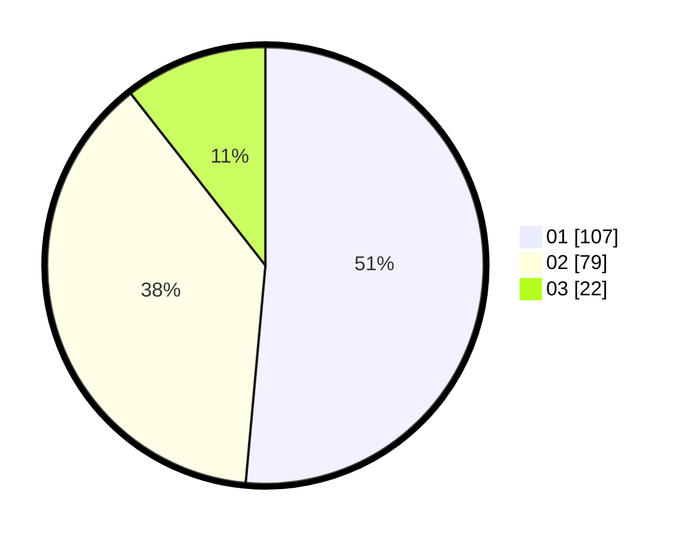

# Hasil

Hasil perolehan suara paslon dapat dilihat pada file paslon-01.txt, paslon-02.txt, dan paslon-03.txt.

Jika tidak ada, artinya data tersebut belum ada pada SIREKAP.

## Perolehan Suara

 * Paslon 01: **107**.
 * Paslon 02: **79**.
 * Paslon 03: **22**.

## Foto C Plano

https://sirekap-obj-formc.kpu.go.id/ee42/pemilu/ppwp/31/75/07/10/07/3175071007058-20240216-134937--6bab1b70-a99f-476b-837a-1c0c1a3d5122.jpg

https://sirekap-obj-formc.kpu.go.id/ee42/pemilu/ppwp/31/75/07/10/07/3175071007058-20240214-203530--3b0a51c7-9d99-4ddc-b9fc-5173f962afb8.jpg

https://sirekap-obj-formc.kpu.go.id/ee42/pemilu/ppwp/31/75/07/10/07/3175071007058-20240216-134937--a34477cc-96de-43ed-a296-f77cec50d5b6.jpg

## DATA PEMILIH TETAP

Jumlah pemilih dalam DPT: **258**.
 * L: **142**.
 * P: **116**.

## DATA PENGGUNA HAK PILIH

Jumlah pengguna hak pilih dalam DPT: **210**.
 * L: **110**.
 * P: **100**.

Jumlah pengguna hak pilih dalam DPTb: **0**.
 * L: **0**.
 * P: **0**.

Jumlah pengguna hak pilih dalam DPK: **1**.
 * L: **0**.
 * P: **1**.

Jumlah pengguna hak pilih: **211**.
 * L: **110**.
 * P: **101**.

## JUMLAH SUARA SAH DAN TIDAK SAH

JUMLAH SELURUH SUARA SAH: **208**.

JUMLAH SUARA TIDAK SAH: **3**.

JUMLAH SELURUH SUARA SAH DAN SUARA TIDAK SAH: **211**.
