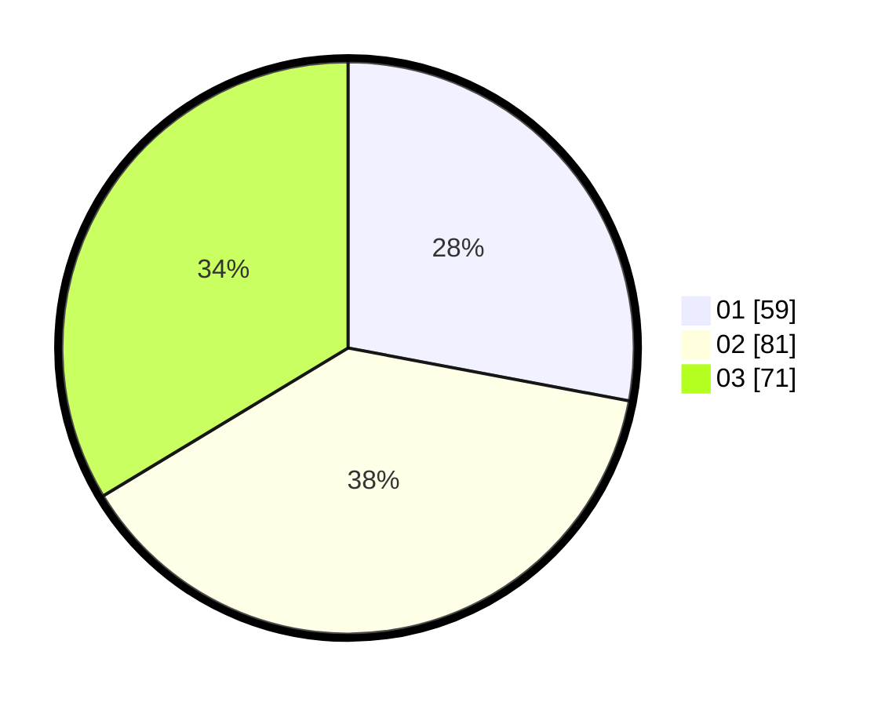

# Hasil

Hasil perolehan suara paslon dapat dilihat pada file paslon-01.txt, paslon-02.txt, dan paslon-03.txt.

Jika tidak ada, artinya data tersebut belum ada pada SIREKAP.

## Perolehan Suara

 * Paslon 01: **59**.
 * Paslon 02: **81**.
 * Paslon 03: **71**.

## Foto C Plano

https://sirekap-obj-formc.kpu.go.id/daa9/pemilu/ppwp/31/75/07/10/07/3175071007063-20240215-212511--24fcf0f9-7324-4061-a877-54035531b551.jpg

https://sirekap-obj-formc.kpu.go.id/daa9/pemilu/ppwp/31/75/07/10/07/3175071007063-20240215-212513--e9d23602-fd99-488d-a754-593f04ebaf04.jpg

https://sirekap-obj-formc.kpu.go.id/daa9/pemilu/ppwp/31/75/07/10/07/3175071007063-20240215-212512--5b0dc197-a5d7-4565-9e68-c0964e95b730.jpg

## DATA PEMILIH TETAP

Jumlah pemilih dalam DPT: **249**.
 * L: **122**.
 * P: **127**.

## DATA PENGGUNA HAK PILIH

Jumlah pengguna hak pilih dalam DPT: **203**.
 * L: **94**.
 * P: **109**.

Jumlah pengguna hak pilih dalam DPTb: **8**.
 * L: **5**.
 * P: **3**.

Jumlah pengguna hak pilih dalam DPK: **1**.
 * L: **0**.
 * P: **1**.

Jumlah pengguna hak pilih: **212**.
 * L: **99**.
 * P: **113**.

## JUMLAH SUARA SAH DAN TIDAK SAH

JUMLAH SELURUH SUARA SAH: **211**.

JUMLAH SUARA TIDAK SAH: **1**.

JUMLAH SELURUH SUARA SAH DAN SUARA TIDAK SAH: **212**.
