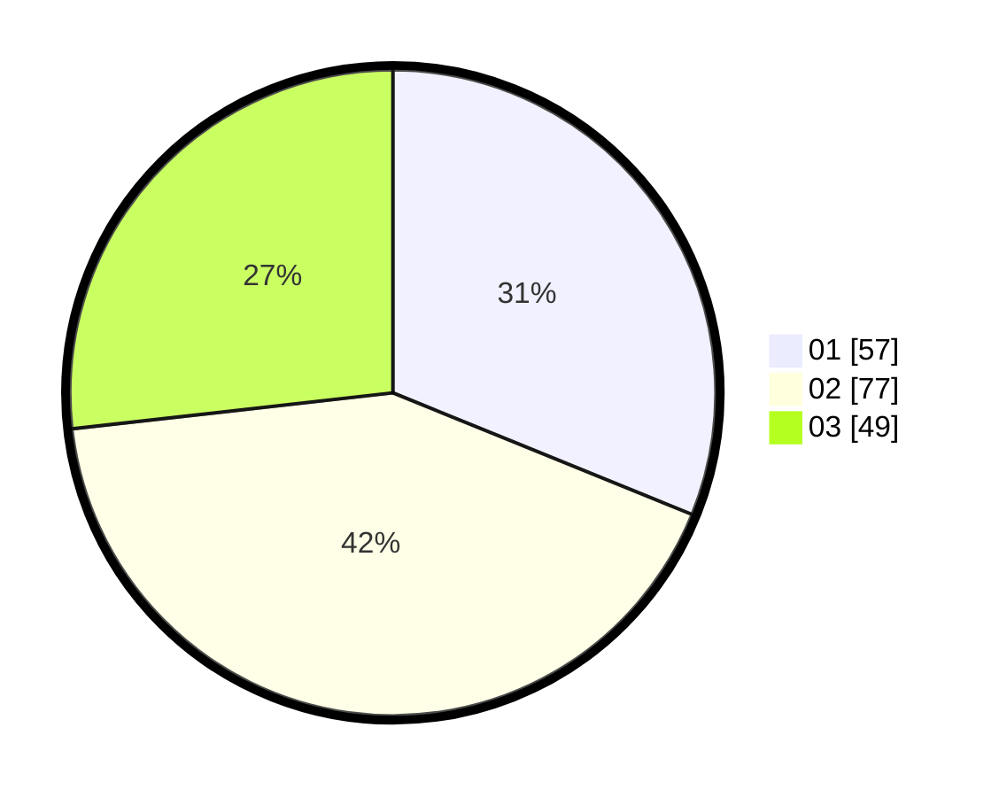

# Hasil

Hasil perolehan suara paslon dapat dilihat pada file paslon-01.txt, paslon-02.txt, dan paslon-03.txt.

Jika tidak ada, artinya data tersebut belum ada pada SIREKAP.

## Perolehan Suara

 * Paslon 01: **57**.
 * Paslon 02: **77**.
 * Paslon 03: **49**.

## Foto C Plano

https://sirekap-obj-formc.kpu.go.id/2f70/pemilu/ppwp/31/75/07/10/07/3175071007064-20240216-155518--014381ad-6e04-48e4-9bd2-38a4164394bb.jpg

https://sirekap-obj-formc.kpu.go.id/2f70/pemilu/ppwp/31/75/07/10/07/3175071007064-20240216-155519--b6b96492-3560-43df-9f41-e23c535b6b1a.jpg

https://sirekap-obj-formc.kpu.go.id/2f70/pemilu/ppwp/31/75/07/10/07/3175071007064-20240216-155519--3759d2aa-ebff-40bd-b12a-eb63790fb490.jpg

## DATA PEMILIH TETAP

Jumlah pemilih dalam DPT: **244**.
 * L: **125**.
 * P: **119**.

## DATA PENGGUNA HAK PILIH

Jumlah pengguna hak pilih dalam DPT: **187**.
 * L: **89**.
 * P: **98**.

Jumlah pengguna hak pilih dalam DPTb: **1**.
 * L: **0**.
 * P: **1**.

Jumlah pengguna hak pilih dalam DPK: **0**.
 * L: **0**.
 * P: **0**.

Jumlah pengguna hak pilih: **188**.
 * L: **89**.
 * P: **99**.

## JUMLAH SUARA SAH DAN TIDAK SAH

JUMLAH SELURUH SUARA SAH: **183**.

JUMLAH SUARA TIDAK SAH: **5**.

JUMLAH SELURUH SUARA SAH DAN SUARA TIDAK SAH: **188**.
