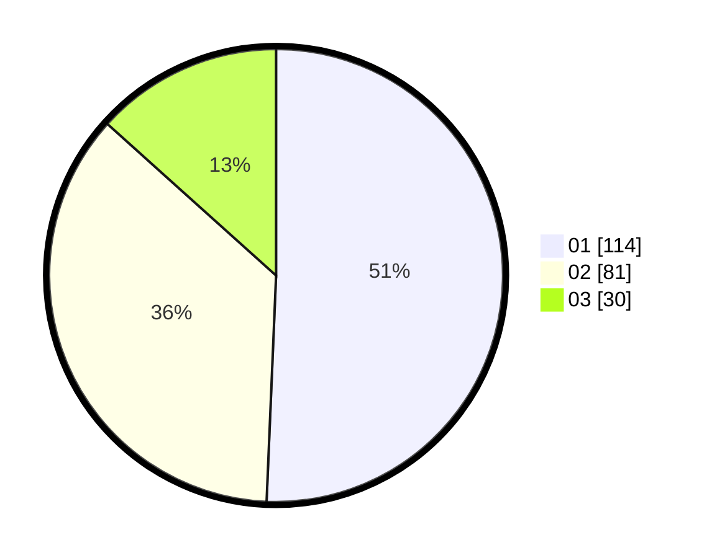

# Hasil

Hasil perolehan suara paslon dapat dilihat pada file paslon-01.txt, paslon-02.txt, dan paslon-03.txt.

Jika tidak ada, artinya data tersebut belum ada pada SIREKAP.

## Perolehan Suara

 * Paslon 01: **114**.
 * Paslon 02: **81**.
 * Paslon 03: **30**.

## Foto C Plano

https://sirekap-obj-formc.kpu.go.id/c079/pemilu/ppwp/31/75/07/10/07/3175071007069-20240216-003605--8b4bed93-248c-46f5-8c20-f02c53d81d14.jpg

https://sirekap-obj-formc.kpu.go.id/c079/pemilu/ppwp/31/75/07/10/07/3175071007069-20240216-003610--2045b73a-a6df-44e1-9b28-a753e084c33f.jpg

https://sirekap-obj-formc.kpu.go.id/c079/pemilu/ppwp/31/75/07/10/07/3175071007069-20240216-003607--4833a67f-c886-4f80-86b0-e0736b385bb5.jpg

## DATA PEMILIH TETAP

Jumlah pemilih dalam DPT: **267**.
 * L: **133**.
 * P: **134**.

## DATA PENGGUNA HAK PILIH

Jumlah pengguna hak pilih dalam DPT: **223**.
 * L: **106**.
 * P: **117**.

Jumlah pengguna hak pilih dalam DPTb: **0**.
 * L: **0**.
 * P: **0**.

Jumlah pengguna hak pilih dalam DPK: **6**.
 * L: **4**.
 * P: **2**.

Jumlah pengguna hak pilih: **229**.
 * L: **110**.
 * P: **119**.

## JUMLAH SUARA SAH DAN TIDAK SAH

JUMLAH SELURUH SUARA SAH: **225**.

JUMLAH SUARA TIDAK SAH: **4**.

JUMLAH SELURUH SUARA SAH DAN SUARA TIDAK SAH: **229**.
