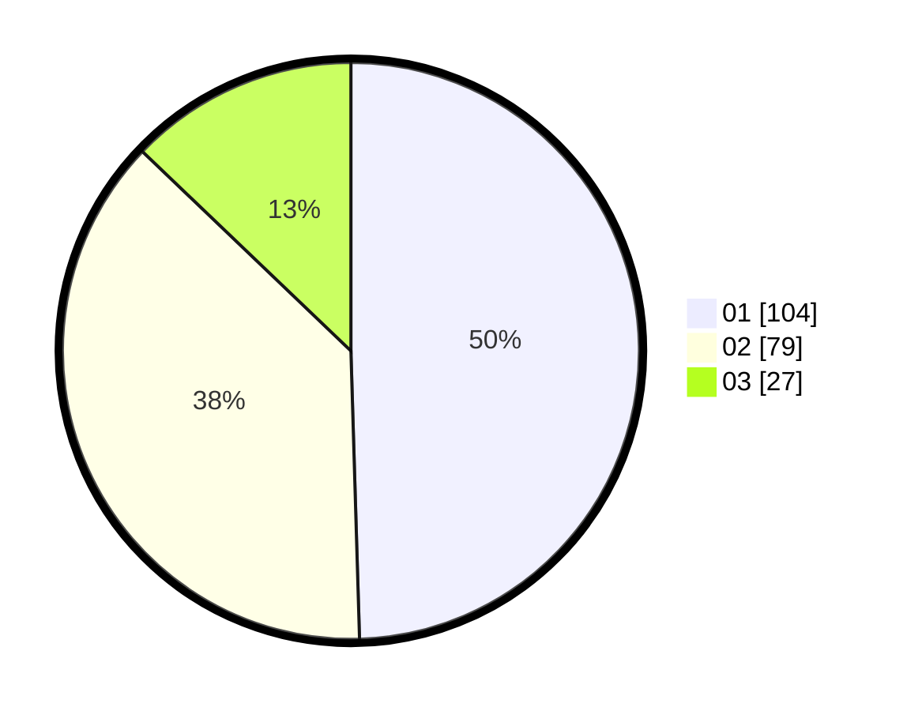

# Hasil

Hasil perolehan suara paslon dapat dilihat pada file paslon-01.txt, paslon-02.txt, dan paslon-03.txt.

Jika tidak ada, artinya data tersebut belum ada pada SIREKAP.

## Perolehan Suara

 * Paslon 01: **104**.
 * Paslon 02: **79**.
 * Paslon 03: **27**.

## Foto C Plano

https://sirekap-obj-formc.kpu.go.id/f625/pemilu/ppwp/31/75/07/10/07/3175071007070-20240214-193618--ca414058-f37b-487b-8ff2-464fdb3d8f90.jpg

https://sirekap-obj-formc.kpu.go.id/f625/pemilu/ppwp/31/75/07/10/07/3175071007070-20240214-193628--f6b09b74-d05d-4fbc-8a9c-b3626223aabc.jpg

https://sirekap-obj-formc.kpu.go.id/f625/pemilu/ppwp/31/75/07/10/07/3175071007070-20240214-193648--ba17c3a0-4c49-48a9-a7b4-19d7d07a5c3f.jpg
