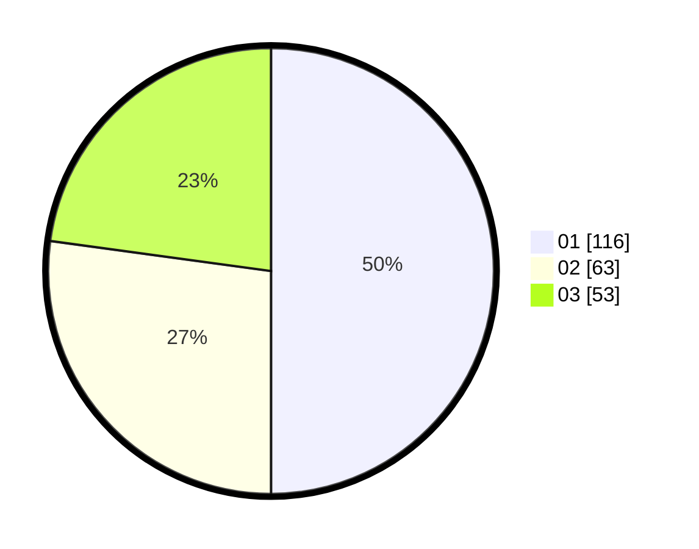

# Hasil

Hasil perolehan suara paslon dapat dilihat pada file paslon-01.txt, paslon-02.txt, dan paslon-03.txt.

Jika tidak ada, artinya data tersebut belum ada pada SIREKAP.

## Perolehan Suara

 * Paslon 01: **116**.
 * Paslon 02: **63**.
 * Paslon 03: **53**.

## Foto C Plano

https://sirekap-obj-formc.kpu.go.id/85c9/pemilu/ppwp/31/75/07/10/07/3175071007073-20240216-132056--c8a55332-1787-420b-84aa-f60b639373f1.jpg

https://sirekap-obj-formc.kpu.go.id/85c9/pemilu/ppwp/31/75/07/10/07/3175071007073-20240216-132057--fb318009-b698-4615-b17f-33867b1b4ac7.jpg

https://sirekap-obj-formc.kpu.go.id/85c9/pemilu/ppwp/31/75/07/10/07/3175071007073-20240216-132057--d4be6133-89d9-4b7e-b363-f3dfbe64592c.jpg

## DATA PEMILIH TETAP

Jumlah pemilih dalam DPT: **256**.
 * L: **111**.
 * P: **145**.

## DATA PENGGUNA HAK PILIH

Jumlah pengguna hak pilih dalam DPT: **219**.
 * L: **95**.
 * P: **124**.

Jumlah pengguna hak pilih dalam DPTb: **2**.
 * L: **0**.
 * P: **2**.

Jumlah pengguna hak pilih dalam DPK: **12**.
 * L: **3**.
 * P: **9**.

Jumlah pengguna hak pilih: **233**.
 * L: **98**.
 * P: **135**.

## JUMLAH SUARA SAH DAN TIDAK SAH

JUMLAH SELURUH SUARA SAH: **232**.

JUMLAH SUARA TIDAK SAH: **1**.

JUMLAH SELURUH SUARA SAH DAN SUARA TIDAK SAH: **233**.
