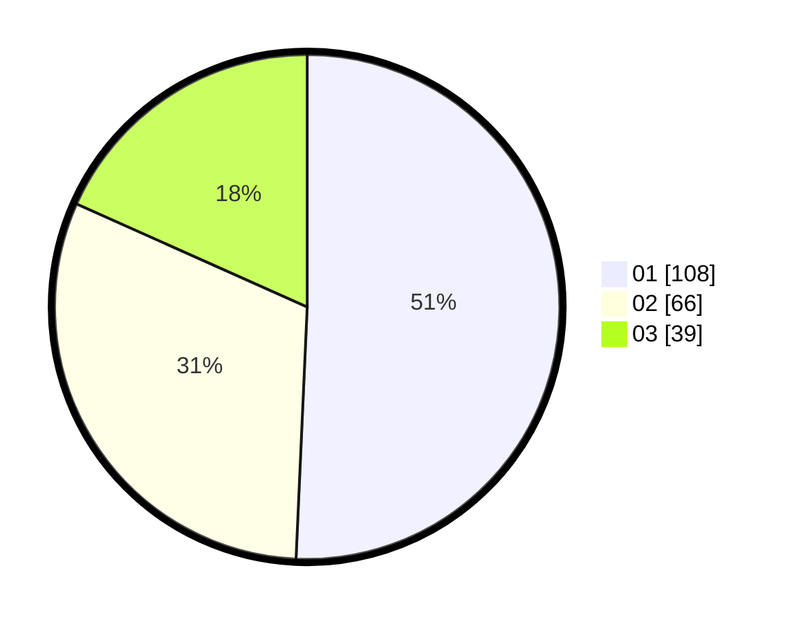

# Hasil

Hasil perolehan suara paslon dapat dilihat pada file paslon-01.txt, paslon-02.txt, dan paslon-03.txt.

Jika tidak ada, artinya data tersebut belum ada pada SIREKAP.

## Perolehan Suara

 * Paslon 01: **108**.
 * Paslon 02: **66**.
 * Paslon 03: **39**.

## Foto C Plano

https://sirekap-obj-formc.kpu.go.id/43ff/pemilu/ppwp/31/75/07/10/07/3175071007077-20240215-042008--359c7709-aa82-4f1f-be99-15614bf96eef.jpg

https://sirekap-obj-formc.kpu.go.id/43ff/pemilu/ppwp/31/75/07/10/07/3175071007077-20240215-042030--39f566de-8387-47df-ada4-22e044431fec.jpg

https://sirekap-obj-formc.kpu.go.id/43ff/pemilu/ppwp/31/75/07/10/07/3175071007077-20240215-042019--f4835d58-acda-44c9-910b-e816aaa9b4a6.jpg

## DATA PEMILIH TETAP

Jumlah pemilih dalam DPT: **255**.
 * L: **114**.
 * P: **141**.

## DATA PENGGUNA HAK PILIH

Jumlah pengguna hak pilih dalam DPT: **213**.
 * L: **94**.
 * P: **119**.

Jumlah pengguna hak pilih dalam DPTb: **0**.
 * L: **0**.
 * P: **0**.

Jumlah pengguna hak pilih dalam DPK: **2**.
 * L: **0**.
 * P: **2**.

Jumlah pengguna hak pilih: **215**.
 * L: **94**.
 * P: **121**.

## JUMLAH SUARA SAH DAN TIDAK SAH

JUMLAH SELURUH SUARA SAH: **213**.

JUMLAH SUARA TIDAK SAH: **2**.

JUMLAH SELURUH SUARA SAH DAN SUARA TIDAK SAH: **215**.
