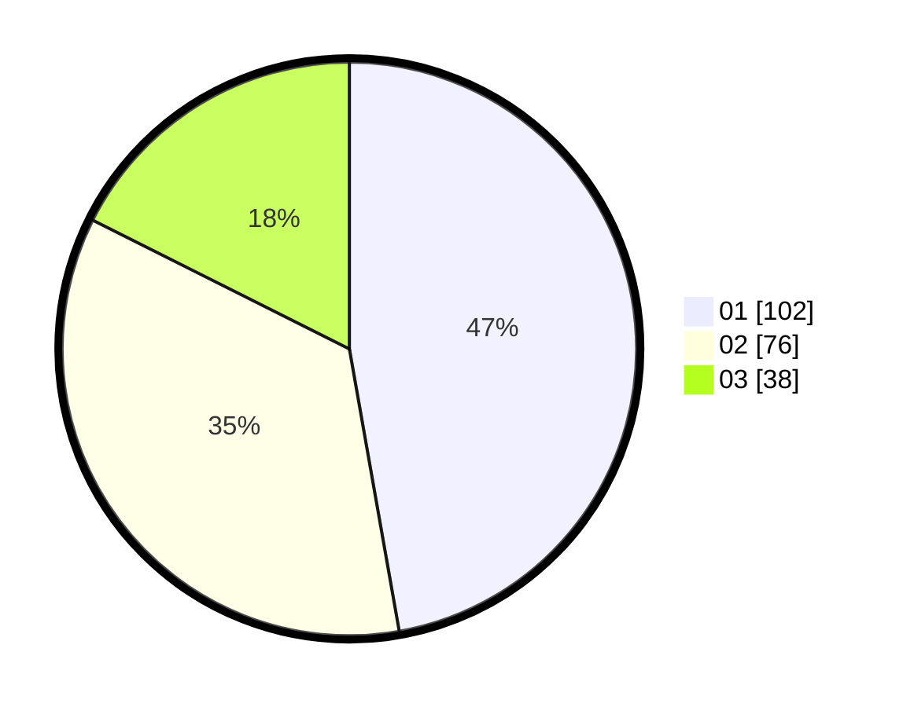

# Hasil

Hasil perolehan suara paslon dapat dilihat pada file paslon-01.txt, paslon-02.txt, dan paslon-03.txt.

Jika tidak ada, artinya data tersebut belum ada pada SIREKAP.

## Perolehan Suara

 * Paslon 01: **102**.
 * Paslon 02: **76**.
 * Paslon 03: **38**.

## Foto C Plano

https://sirekap-obj-formc.kpu.go.id/bb33/pemilu/ppwp/31/75/07/10/07/3175071007079-20240214-221916--701284a6-c8d5-46b9-9b93-ec2de8e662b7.jpg

https://sirekap-obj-formc.kpu.go.id/bb33/pemilu/ppwp/31/75/07/10/07/3175071007079-20240214-222014--c7ab00c0-602e-4815-aee7-283401752ce9.jpg

https://sirekap-obj-formc.kpu.go.id/bb33/pemilu/ppwp/31/75/07/10/07/3175071007079-20240214-222150--236b8adb-72de-4bc2-ab2f-3e07534e033e.jpg
