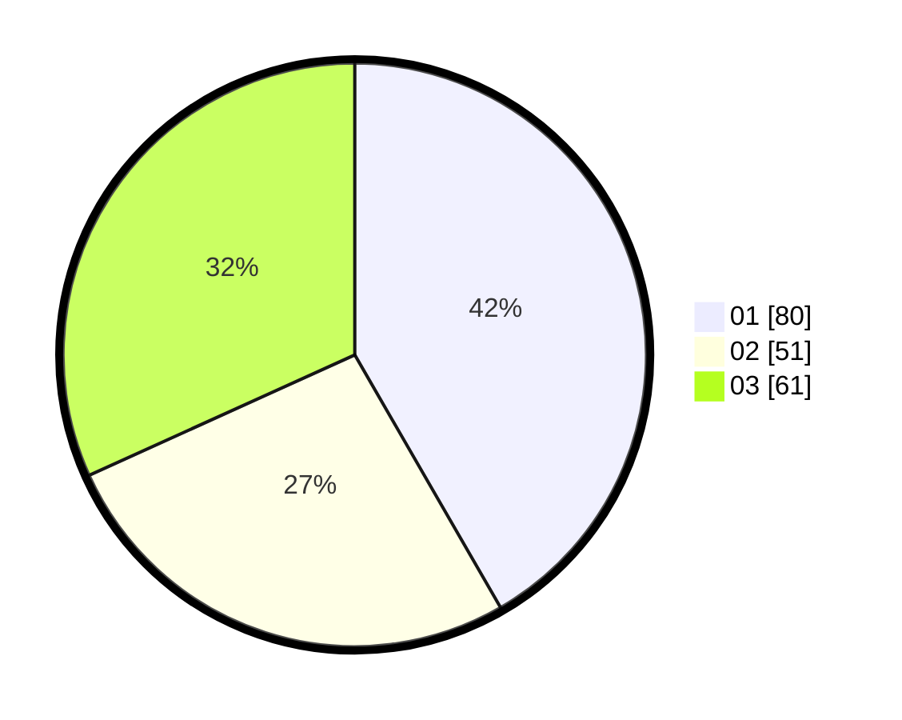

# Hasil

Hasil perolehan suara paslon dapat dilihat pada file paslon-01.txt, paslon-02.txt, dan paslon-03.txt.

Jika tidak ada, artinya data tersebut belum ada pada SIREKAP.

## Perolehan Suara

 * Paslon 01: **80**.
 * Paslon 02: **51**.
 * Paslon 03: **61**.

## Foto C Plano

https://sirekap-obj-formc.kpu.go.id/ff4b/pemilu/ppwp/31/75/07/10/07/3175071007085-20240214-224847--7293e7fd-faaf-4ade-90dd-4494f6bb4ad6.jpg

https://sirekap-obj-formc.kpu.go.id/ff4b/pemilu/ppwp/31/75/07/10/07/3175071007085-20240214-224929--88a595c1-3015-4cca-9770-cbf1cb1223e1.jpg

https://sirekap-obj-formc.kpu.go.id/ff4b/pemilu/ppwp/31/75/07/10/07/3175071007085-20240214-225019--7b770f4c-1f7d-411c-8758-c854db4d3698.jpg

## DATA PEMILIH TETAP

Jumlah pemilih dalam DPT: **244**.
 * L: **131**.
 * P: **131**.

## DATA PENGGUNA HAK PILIH

Jumlah pengguna hak pilih dalam DPT: **189**.
 * L: **82**.
 * P: **104**.

Jumlah pengguna hak pilih dalam DPTb: **5**.
 * L: **5**.
 * P: **0**.

Jumlah pengguna hak pilih dalam DPK: **0**.
 * L: **0**.
 * P: **0**.

Jumlah pengguna hak pilih: **194**.
 * L: **90**.
 * P: **104**.

## JUMLAH SUARA SAH DAN TIDAK SAH

JUMLAH SELURUH SUARA SAH: **192**.

JUMLAH SUARA TIDAK SAH: **2**.

JUMLAH SELURUH SUARA SAH DAN SUARA TIDAK SAH: **194**.
