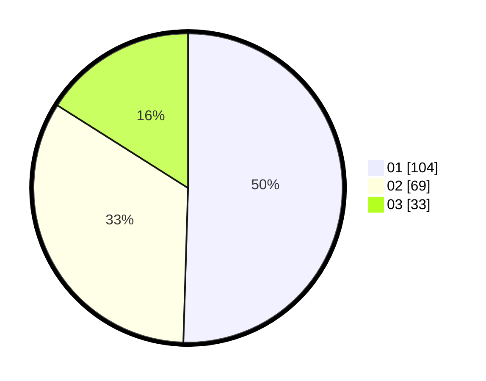

# Hasil

Hasil perolehan suara paslon dapat dilihat pada file paslon-01.txt, paslon-02.txt, dan paslon-03.txt.

Jika tidak ada, artinya data tersebut belum ada pada SIREKAP.

## Perolehan Suara

 * Paslon 01: **104**.
 * Paslon 02: **69**.
 * Paslon 03: **33**.

## Foto C Plano

https://sirekap-obj-formc.kpu.go.id/0144/pemilu/ppwp/31/75/07/10/07/3175071007096-20240216-134256--15226fce-4af0-4538-a526-a2e2fccbeeb7.jpg

https://sirekap-obj-formc.kpu.go.id/0144/pemilu/ppwp/31/75/07/10/07/3175071007096-20240216-134257--9cccb3fa-c328-4bcf-ade6-28040309aecb.jpg

https://sirekap-obj-formc.kpu.go.id/0144/pemilu/ppwp/31/75/07/10/07/3175071007096-20240216-134257--eeda9ddb-4da5-47d2-bf3e-6217135ad6ae.jpg

## DATA PEMILIH TETAP

Jumlah pemilih dalam DPT: **264**.
 * L: **129**.
 * P: **135**.

## DATA PENGGUNA HAK PILIH

Jumlah pengguna hak pilih dalam DPT: **209**.
 * L: **99**.
 * P: **110**.

Jumlah pengguna hak pilih dalam DPTb: **0**.
 * L: **0**.
 * P: **0**.

Jumlah pengguna hak pilih dalam DPK: **0**.
 * L: **0**.
 * P: **0**.

Jumlah pengguna hak pilih: **209**.
 * L: **99**.
 * P: **110**.

## JUMLAH SUARA SAH DAN TIDAK SAH

JUMLAH SELURUH SUARA SAH: **206**.

JUMLAH SUARA TIDAK SAH: **3**.

JUMLAH SELURUH SUARA SAH DAN SUARA TIDAK SAH: **209**.
