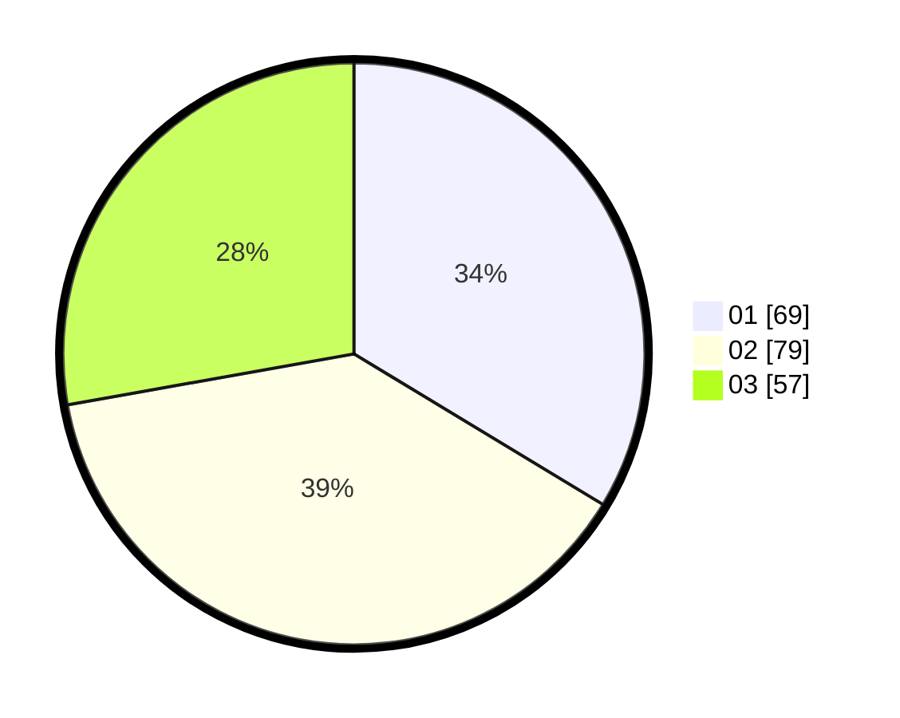

# Hasil

Hasil perolehan suara paslon dapat dilihat pada file paslon-01.txt, paslon-02.txt, dan paslon-03.txt.

Jika tidak ada, artinya data tersebut belum ada pada SIREKAP.

## Perolehan Suara

 * Paslon 01: **69**.
 * Paslon 02: **79**.
 * Paslon 03: **57**.

## Foto C Plano

https://sirekap-obj-formc.kpu.go.id/0d38/pemilu/ppwp/31/75/07/10/07/3175071007098-20240214-222021--ed1be9cc-b3e5-40c9-8bd3-bc0b147573da.jpg

https://sirekap-obj-formc.kpu.go.id/0d38/pemilu/ppwp/31/75/07/10/07/3175071007098-20240214-195506--5eb96fb8-3716-42a2-a096-181383645522.jpg

https://sirekap-obj-formc.kpu.go.id/0d38/pemilu/ppwp/31/75/07/10/07/3175071007098-20240214-222332--1e987f7d-68a3-4a36-a620-7b20a6077550.jpg
