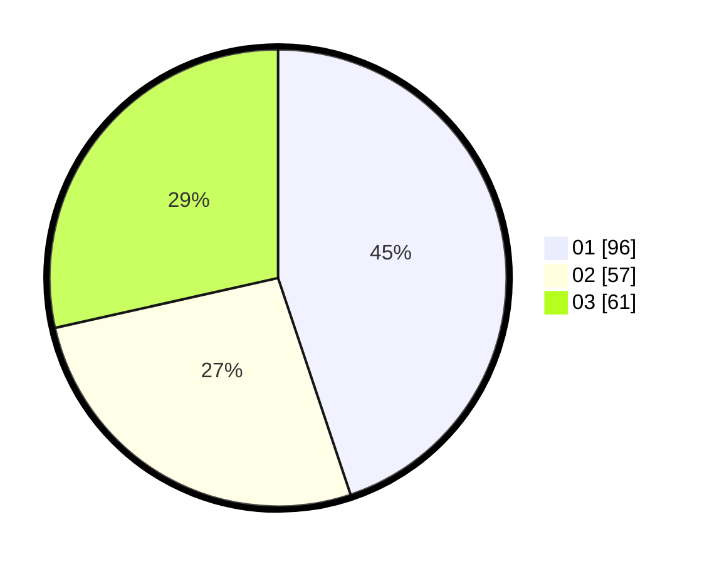

# Hasil

Hasil perolehan suara paslon dapat dilihat pada file paslon-01.txt, paslon-02.txt, dan paslon-03.txt.

Jika tidak ada, artinya data tersebut belum ada pada SIREKAP.

## Perolehan Suara

 * Paslon 01: **96**.
 * Paslon 02: **57**.
 * Paslon 03: **61**.

## Foto C Plano

https://sirekap-obj-formc.kpu.go.id/3b9a/pemilu/ppwp/31/75/07/10/07/3175071007101-20240215-165042--7dd83d8c-ea22-426e-8f48-7bafcc4c0847.jpg

https://sirekap-obj-formc.kpu.go.id/3b9a/pemilu/ppwp/31/75/07/10/07/3175071007101-20240216-010817--0815452b-71b2-4ebc-9bc3-54f58bceb99b.jpg

https://sirekap-obj-formc.kpu.go.id/3b9a/pemilu/ppwp/31/75/07/10/07/3175071007101-20240216-010817--a53c2737-3498-4f19-bc5d-bf6dd31d90a0.jpg

## DATA PEMILIH TETAP

Jumlah pemilih dalam DPT: **0**.
 * L: **0**.
 * P: **0**.

## DATA PENGGUNA HAK PILIH

Jumlah pengguna hak pilih dalam DPT: **0**.
 * L: **0**.
 * P: **0**.

Jumlah pengguna hak pilih dalam DPTb: **0**.
 * L: **0**.
 * P: **0**.

Jumlah pengguna hak pilih dalam DPK: **0**.
 * L: **0**.
 * P: **0**.

Jumlah pengguna hak pilih: **0**.
 * L: **0**.
 * P: **0**.

## JUMLAH SUARA SAH DAN TIDAK SAH

JUMLAH SELURUH SUARA SAH: **214**.

JUMLAH SUARA TIDAK SAH: **6**.

JUMLAH SELURUH SUARA SAH DAN SUARA TIDAK SAH: **220**.
