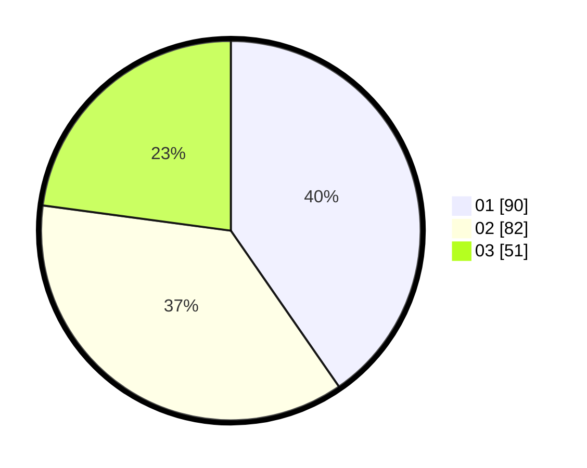

# Hasil

Hasil perolehan suara paslon dapat dilihat pada file paslon-01.txt, paslon-02.txt, dan paslon-03.txt.

Jika tidak ada, artinya data tersebut belum ada pada SIREKAP.

## Perolehan Suara

 * Paslon 01: **90**.
 * Paslon 02: **82**.
 * Paslon 03: **51**.

## Foto C Plano

https://sirekap-obj-formc.kpu.go.id/4112/pemilu/ppwp/31/75/07/10/07/3175071007106-20240216-022635--2d7a2a5b-812a-4b66-9642-20fe5a34beb9.jpg

https://sirekap-obj-formc.kpu.go.id/4112/pemilu/ppwp/31/75/07/10/07/3175071007106-20240216-022641--2a8bafed-8482-47fd-aa5f-bc8b3e46eea1.jpg

https://sirekap-obj-formc.kpu.go.id/4112/pemilu/ppwp/31/75/07/10/07/3175071007106-20240216-014045--2f7a5865-596b-43d7-b949-f84d4536f013.jpg

## DATA PEMILIH TETAP

Jumlah pemilih dalam DPT: **267**.
 * L: **117**.
 * P: **150**.

## DATA PENGGUNA HAK PILIH

Jumlah pengguna hak pilih dalam DPT: **220**.
 * L: **91**.
 * P: **129**.

Jumlah pengguna hak pilih dalam DPTb: **3**.
 * L: **2**.
 * P: **1**.

Jumlah pengguna hak pilih dalam DPK: **2**.
 * L: **2**.
 * P: **0**.

Jumlah pengguna hak pilih: **225**.
 * L: **95**.
 * P: **130**.

## JUMLAH SUARA SAH DAN TIDAK SAH

JUMLAH SELURUH SUARA SAH: **223**.

JUMLAH SUARA TIDAK SAH: **2**.

JUMLAH SELURUH SUARA SAH DAN SUARA TIDAK SAH: **225**.
