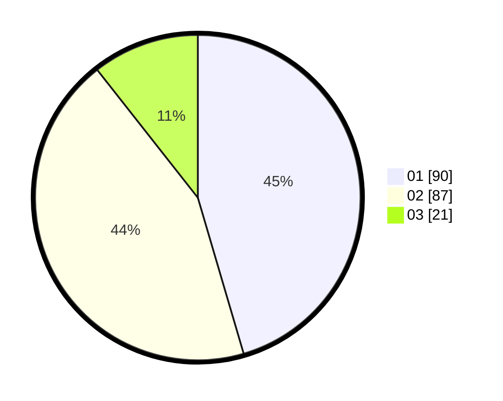

# Hasil

Hasil perolehan suara paslon dapat dilihat pada file paslon-01.txt, paslon-02.txt, dan paslon-03.txt.

Jika tidak ada, artinya data tersebut belum ada pada SIREKAP.

## Perolehan Suara

 * Paslon 01: **90**.
 * Paslon 02: **87**.
 * Paslon 03: **21**.

## Foto C Plano

https://sirekap-obj-formc.kpu.go.id/23fb/pemilu/ppwp/31/75/07/10/07/3175071007115-20240215-220106--0918d24a-e5c7-4ee7-98fe-b6e407d53481.jpg

https://sirekap-obj-formc.kpu.go.id/23fb/pemilu/ppwp/31/75/07/10/07/3175071007115-20240215-220109--4e7f47bc-d9b3-4570-8254-d7b439d75822.jpg

https://sirekap-obj-formc.kpu.go.id/23fb/pemilu/ppwp/31/75/07/10/07/3175071007115-20240215-220108--53acdcef-32ab-47d8-a75e-7ddcd662fa29.jpg

## DATA PEMILIH TETAP

Jumlah pemilih dalam DPT: **250**.
 * L: **117**.
 * P: **133**.

## DATA PENGGUNA HAK PILIH

Jumlah pengguna hak pilih dalam DPT: **193**.
 * L: **85**.
 * P: **108**.

Jumlah pengguna hak pilih dalam DPTb: **6**.
 * L: **5**.
 * P: **1**.

Jumlah pengguna hak pilih dalam DPK: **0**.
 * L: **0**.
 * P: **0**.

Jumlah pengguna hak pilih: **199**.
 * L: **90**.
 * P: **109**.

## JUMLAH SUARA SAH DAN TIDAK SAH

JUMLAH SELURUH SUARA SAH: **198**.

JUMLAH SUARA TIDAK SAH: **1**.

JUMLAH SELURUH SUARA SAH DAN SUARA TIDAK SAH: **199**.
