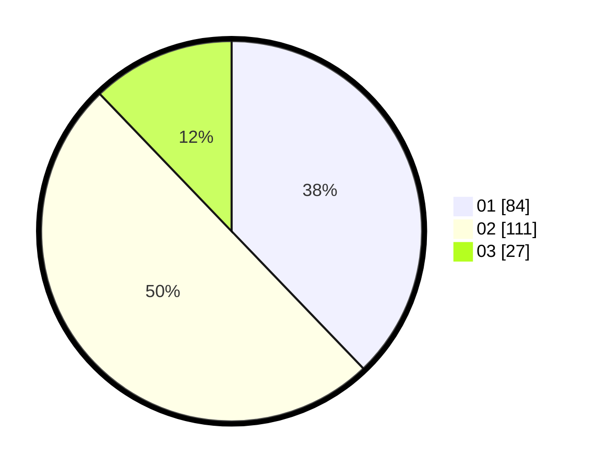

# Hasil

Hasil perolehan suara paslon dapat dilihat pada file paslon-01.txt, paslon-02.txt, dan paslon-03.txt.

Jika tidak ada, artinya data tersebut belum ada pada SIREKAP.

## Perolehan Suara

 * Paslon 01: **84**.
 * Paslon 02: **111**.
 * Paslon 03: **27**.

## Foto C Plano

https://sirekap-obj-formc.kpu.go.id/c3f0/pemilu/ppwp/31/75/07/10/07/3175071007121-20240216-085910--6c064469-3040-4f79-8ffb-6f3891b9e2b0.jpg

https://sirekap-obj-formc.kpu.go.id/c3f0/pemilu/ppwp/31/75/07/10/07/3175071007121-20240216-085912--a3e64e00-5ed3-4b8e-a6fd-87cada1c667f.jpg

https://sirekap-obj-formc.kpu.go.id/c3f0/pemilu/ppwp/31/75/07/10/07/3175071007121-20240216-085911--b8c475d4-6e6b-4df3-992c-69f62a2ae92a.jpg

## DATA PEMILIH TETAP

Jumlah pemilih dalam DPT: **260**.
 * L: **136**.
 * P: **124**.

## DATA PENGGUNA HAK PILIH

Jumlah pengguna hak pilih dalam DPT: **221**.
 * L: **112**.
 * P: **109**.

Jumlah pengguna hak pilih dalam DPTb: **0**.
 * L: **0**.
 * P: **0**.

Jumlah pengguna hak pilih dalam DPK: **3**.
 * L: **0**.
 * P: **3**.

Jumlah pengguna hak pilih: **224**.
 * L: **112**.
 * P: **112**.

## JUMLAH SUARA SAH DAN TIDAK SAH

JUMLAH SELURUH SUARA SAH: **222**.

JUMLAH SUARA TIDAK SAH: **2**.

JUMLAH SELURUH SUARA SAH DAN SUARA TIDAK SAH: **224**.
