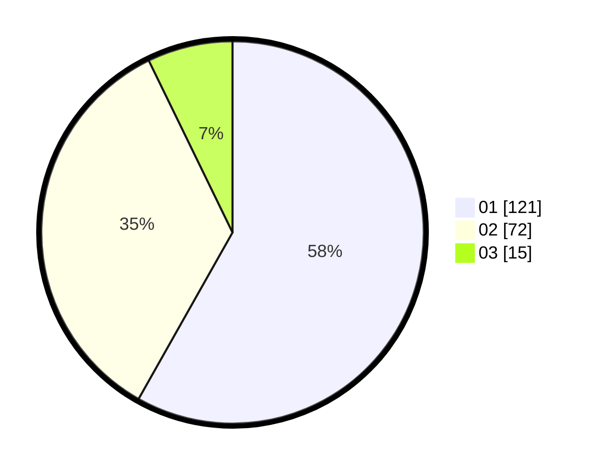

# Hasil

Hasil perolehan suara paslon dapat dilihat pada file paslon-01.txt, paslon-02.txt, dan paslon-03.txt.

Jika tidak ada, artinya data tersebut belum ada pada SIREKAP.

## Perolehan Suara

 * Paslon 01: **121**.
 * Paslon 02: **72**.
 * Paslon 03: **15**.

## Foto C Plano

https://sirekap-obj-formc.kpu.go.id/d221/pemilu/ppwp/31/75/07/10/07/3175071007126-20240216-013100--2d474d68-1e02-4ddb-968c-0578a1774870.jpg

https://sirekap-obj-formc.kpu.go.id/d221/pemilu/ppwp/31/75/07/10/07/3175071007126-20240216-013114--57339bec-e9a2-4099-a6b5-c30b130718c2.jpg

https://sirekap-obj-formc.kpu.go.id/d221/pemilu/ppwp/31/75/07/10/07/3175071007126-20240216-013106--ed928874-6735-4a93-962f-b1483a090997.jpg

## DATA PEMILIH TETAP

Jumlah pemilih dalam DPT: **257**.
 * L: **142**.
 * P: **115**.

## DATA PENGGUNA HAK PILIH

Jumlah pengguna hak pilih dalam DPT: **210**.
 * L: **111**.
 * P: **99**.

Jumlah pengguna hak pilih dalam DPTb: **0**.
 * L: **0**.
 * P: **0**.

Jumlah pengguna hak pilih dalam DPK: **1**.
 * L: **1**.
 * P: **0**.

Jumlah pengguna hak pilih: **211**.
 * L: **112**.
 * P: **99**.

## JUMLAH SUARA SAH DAN TIDAK SAH

JUMLAH SELURUH SUARA SAH: **208**.

JUMLAH SUARA TIDAK SAH: **3**.

JUMLAH SELURUH SUARA SAH DAN SUARA TIDAK SAH: **211**.
