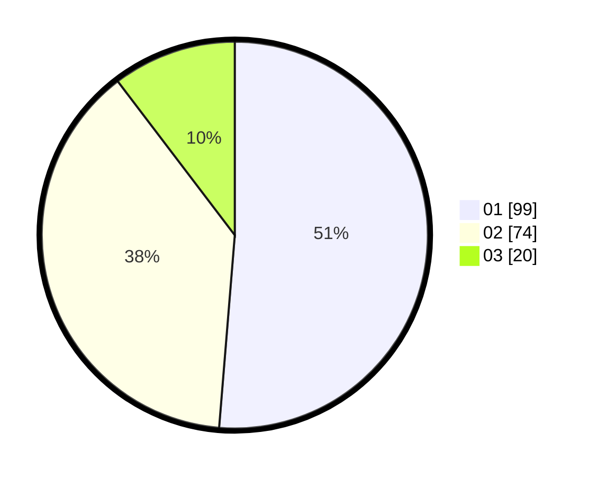

# Hasil

Hasil perolehan suara paslon dapat dilihat pada file paslon-01.txt, paslon-02.txt, dan paslon-03.txt.

Jika tidak ada, artinya data tersebut belum ada pada SIREKAP.

## Perolehan Suara

 * Paslon 01: **99**.
 * Paslon 02: **74**.
 * Paslon 03: **20**.

## Foto C Plano

https://sirekap-obj-formc.kpu.go.id/d015/pemilu/ppwp/31/75/07/10/07/3175071007127-20240214-155528--34616dd8-389f-4b2e-9d93-62a53ba1f72b.jpg

https://sirekap-obj-formc.kpu.go.id/d015/pemilu/ppwp/31/75/07/10/07/3175071007127-20240214-155705--046169f0-7092-4cc9-9e5a-dd990518d2ce.jpg

https://sirekap-obj-formc.kpu.go.id/d015/pemilu/ppwp/31/75/07/10/07/3175071007127-20240216-043653--85422d56-b144-4cd0-9a83-dcb087801d93.jpg

## DATA PEMILIH TETAP

Jumlah pemilih dalam DPT: **247**.
 * L: **128**.
 * P: **119**.

## DATA PENGGUNA HAK PILIH

Jumlah pengguna hak pilih dalam DPT: **201**.
 * L: **101**.
 * P: **100**.

Jumlah pengguna hak pilih dalam DPTb: **0**.
 * L: **0**.
 * P: **0**.

Jumlah pengguna hak pilih dalam DPK: **5**.
 * L: **1**.
 * P: **4**.

Jumlah pengguna hak pilih: **206**.
 * L: **102**.
 * P: **104**.

## JUMLAH SUARA SAH DAN TIDAK SAH

JUMLAH SELURUH SUARA SAH: **193**.

JUMLAH SUARA TIDAK SAH: **13**.

JUMLAH SELURUH SUARA SAH DAN SUARA TIDAK SAH: **206**.
