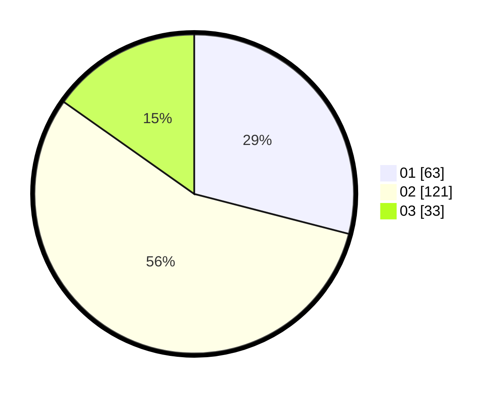

# Hasil

Hasil perolehan suara paslon dapat dilihat pada file paslon-01.txt, paslon-02.txt, dan paslon-03.txt.

Jika tidak ada, artinya data tersebut belum ada pada SIREKAP.

## Perolehan Suara

 * Paslon 01: **63**.
 * Paslon 02: **121**.
 * Paslon 03: **33**.

## Foto C Plano

https://sirekap-obj-formc.kpu.go.id/845e/pemilu/ppwp/31/75/08/10/01/3175081001001-20240214-204853--17f264f9-4756-41aa-bb33-f07ec0586db1.jpg

https://sirekap-obj-formc.kpu.go.id/845e/pemilu/ppwp/31/75/08/10/01/3175081001001-20240214-205945--3440b720-d3f8-456f-acb9-3ddc94c42b72.jpg
