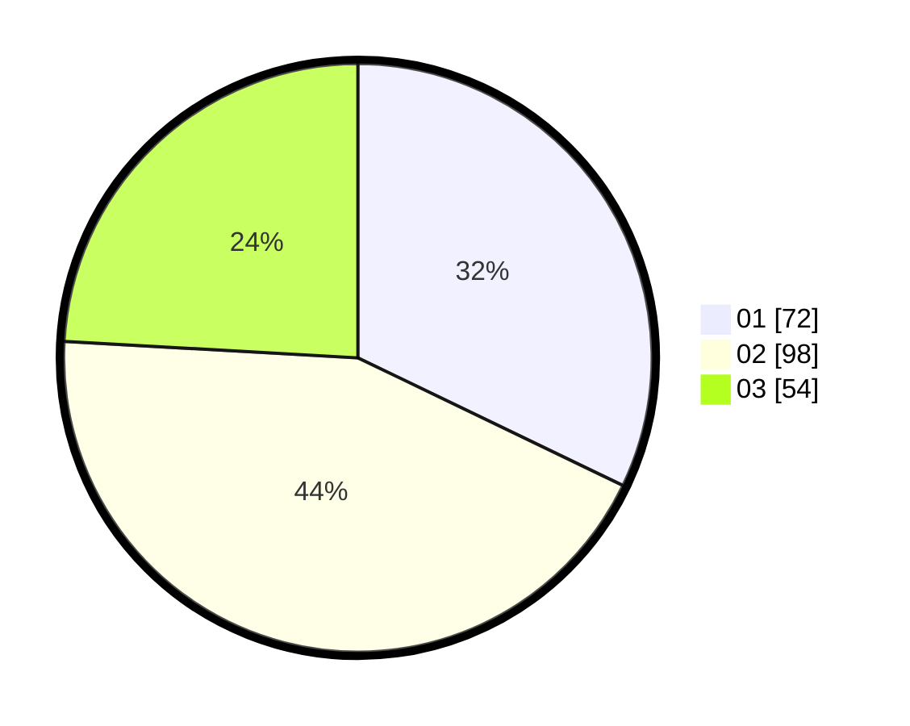

# Hasil

Hasil perolehan suara paslon dapat dilihat pada file paslon-01.txt, paslon-02.txt, dan paslon-03.txt.

Jika tidak ada, artinya data tersebut belum ada pada SIREKAP.

## Perolehan Suara

 * Paslon 01: **72**.
 * Paslon 02: **98**.
 * Paslon 03: **54**.

## Foto C Plano

https://sirekap-obj-formc.kpu.go.id/63e8/pemilu/ppwp/31/75/08/10/01/3175081001017-20240214-194644--4fb576d9-906e-464d-a302-814377bc02ae.jpg

https://sirekap-obj-formc.kpu.go.id/63e8/pemilu/ppwp/31/75/08/10/01/3175081001017-20240214-194845--8aaec0d8-132c-4a1d-a759-67bb96b2e92c.jpg

https://sirekap-obj-formc.kpu.go.id/63e8/pemilu/ppwp/31/75/08/10/01/3175081001017-20240214-195054--c7eef5b7-9d4e-457a-a2fa-037c3e01531c.jpg

## DATA PEMILIH TETAP

Jumlah pemilih dalam DPT: **258**.
 * L: **127**.
 * P: **131**.

## DATA PENGGUNA HAK PILIH

Jumlah pengguna hak pilih dalam DPT: **222**.
 * L: **98**.
 * P: **124**.

Jumlah pengguna hak pilih dalam DPTb: **0**.
 * L: **0**.
 * P: **0**.

Jumlah pengguna hak pilih dalam DPK: **5**.
 * L: **3**.
 * P: **2**.

Jumlah pengguna hak pilih: **227**.
 * L: **101**.
 * P: **126**.

## JUMLAH SUARA SAH DAN TIDAK SAH

JUMLAH SELURUH SUARA SAH: **224**.

JUMLAH SUARA TIDAK SAH: **3**.

JUMLAH SELURUH SUARA SAH DAN SUARA TIDAK SAH: **227**.
