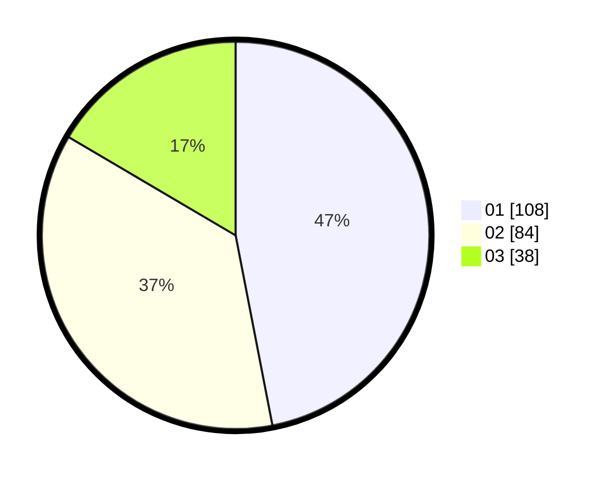

# Hasil

Hasil perolehan suara paslon dapat dilihat pada file paslon-01.txt, paslon-02.txt, dan paslon-03.txt.

Jika tidak ada, artinya data tersebut belum ada pada SIREKAP.

## Perolehan Suara

 * Paslon 01: **108**.
 * Paslon 02: **84**.
 * Paslon 03: **38**.

## Foto C Plano

https://sirekap-obj-formc.kpu.go.id/75ec/pemilu/ppwp/31/75/08/10/01/3175081001019-20240215-002606--ddf93e50-eed7-4246-966c-33b10824dfed.jpg

https://sirekap-obj-formc.kpu.go.id/75ec/pemilu/ppwp/31/75/08/10/01/3175081001019-20240215-002825--aeaa2252-2f3d-40e0-b7d3-e8284a0bb53e.jpg

https://sirekap-obj-formc.kpu.go.id/75ec/pemilu/ppwp/31/75/08/10/01/3175081001019-20240215-003002--b9536fcd-99a1-45a0-bc00-89d3b0b7b06f.jpg
