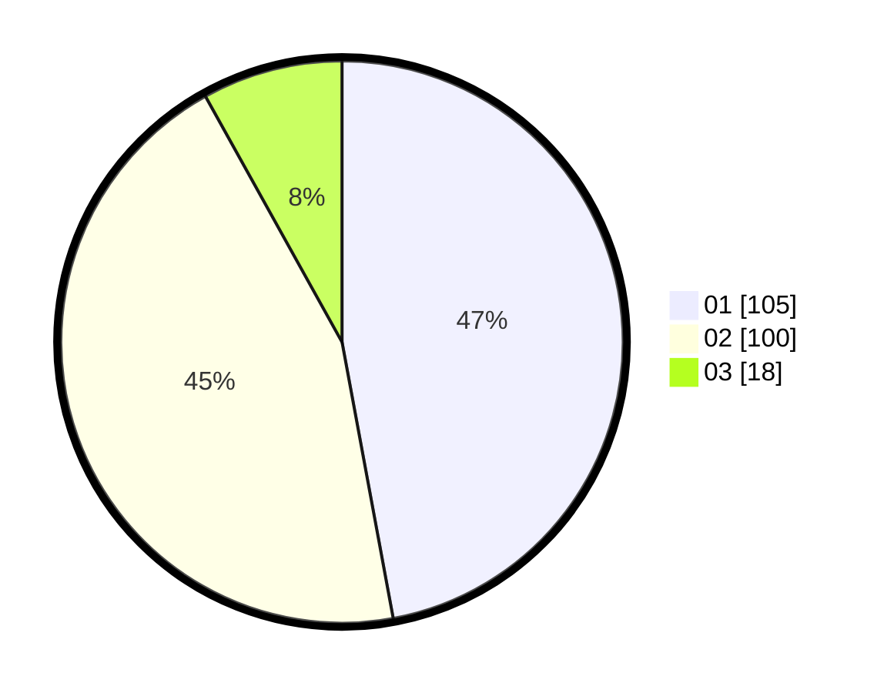

# Hasil

Hasil perolehan suara paslon dapat dilihat pada file paslon-01.txt, paslon-02.txt, dan paslon-03.txt.

Jika tidak ada, artinya data tersebut belum ada pada SIREKAP.

## Perolehan Suara

 * Paslon 01: **105**.
 * Paslon 02: **100**.
 * Paslon 03: **18**.

## Foto C Plano

https://sirekap-obj-formc.kpu.go.id/3e9d/pemilu/ppwp/31/75/08/10/01/3175081001020-20240216-145150--2a4e7115-2ad1-468b-acb7-580ba7452c78.jpg

https://sirekap-obj-formc.kpu.go.id/3e9d/pemilu/ppwp/31/75/08/10/01/3175081001020-20240216-145152--7574e271-10cd-472a-940f-7127dc5d7043.jpg

https://sirekap-obj-formc.kpu.go.id/3e9d/pemilu/ppwp/31/75/08/10/01/3175081001020-20240216-145151--37611048-10fd-4c26-9c9a-d4dafd5a58ef.jpg

## DATA PEMILIH TETAP

Jumlah pemilih dalam DPT: **269**.
 * L: **127**.
 * P: **142**.

## DATA PENGGUNA HAK PILIH

Jumlah pengguna hak pilih dalam DPT: **223**.
 * L: **102**.
 * P: **121**.

Jumlah pengguna hak pilih dalam DPTb: **0**.
 * L: **0**.
 * P: **0**.

Jumlah pengguna hak pilih dalam DPK: **0**.
 * L: **0**.
 * P: **0**.

Jumlah pengguna hak pilih: **223**.
 * L: **102**.
 * P: **121**.

## JUMLAH SUARA SAH DAN TIDAK SAH

JUMLAH SELURUH SUARA SAH: **223**.

JUMLAH SUARA TIDAK SAH: **0**.

JUMLAH SELURUH SUARA SAH DAN SUARA TIDAK SAH: **223**.
