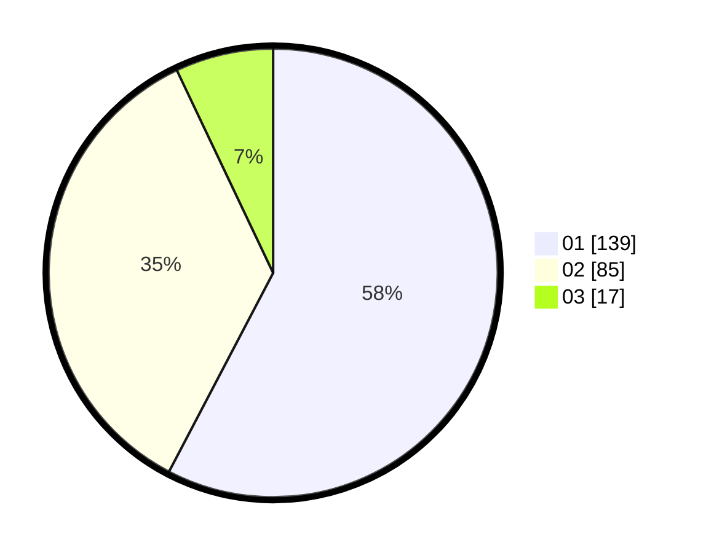

# Hasil

Hasil perolehan suara paslon dapat dilihat pada file paslon-01.txt, paslon-02.txt, dan paslon-03.txt.

Jika tidak ada, artinya data tersebut belum ada pada SIREKAP.

## Perolehan Suara

 * Paslon 01: **139**.
 * Paslon 02: **85**.
 * Paslon 03: **17**.

## Foto C Plano

https://sirekap-obj-formc.kpu.go.id/5722/pemilu/ppwp/31/75/08/10/01/3175081001029-20240214-211630--6b28014e-b81f-453b-ace1-4e6df614d9ea.jpg

https://sirekap-obj-formc.kpu.go.id/5722/pemilu/ppwp/31/75/08/10/01/3175081001029-20240214-201035--5ea0f848-1863-44f4-9a83-9f97bca4c74a.jpg

https://sirekap-obj-formc.kpu.go.id/5722/pemilu/ppwp/31/75/08/10/01/3175081001029-20240214-212103--0de926b7-61bc-4275-bb8a-5156b2fa75e9.jpg
