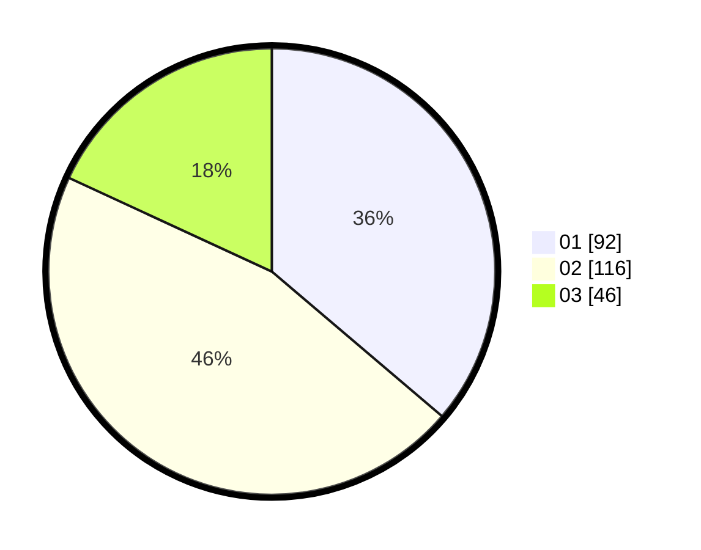

# Hasil

Hasil perolehan suara paslon dapat dilihat pada file paslon-01.txt, paslon-02.txt, dan paslon-03.txt.

Jika tidak ada, artinya data tersebut belum ada pada SIREKAP.

## Perolehan Suara

 * Paslon 01: **92**.
 * Paslon 02: **116**.
 * Paslon 03: **46**.

## Foto C Plano

https://sirekap-obj-formc.kpu.go.id/9a38/pemilu/ppwp/31/75/08/10/01/3175081001030-20240214-233105--7f33e0ad-3405-401d-8cdc-0caf3ec61e4b.jpg

https://sirekap-obj-formc.kpu.go.id/9a38/pemilu/ppwp/31/75/08/10/01/3175081001030-20240214-234547--3cdcca02-96cb-43a1-8a2c-b8f536c19282.jpg

https://sirekap-obj-formc.kpu.go.id/9a38/pemilu/ppwp/31/75/08/10/01/3175081001030-20240214-234914--e95547fd-0975-49ab-ba78-74c860d7d1b0.jpg
