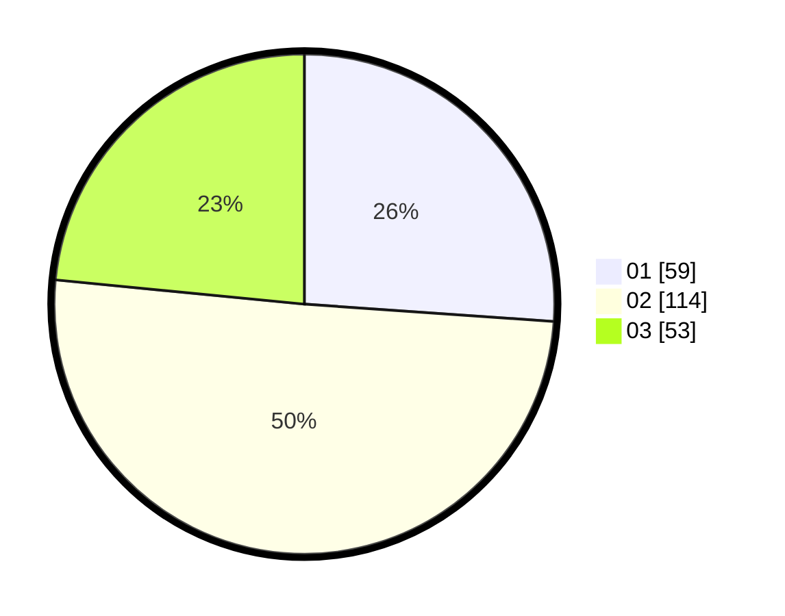

# Hasil

Hasil perolehan suara paslon dapat dilihat pada file paslon-01.txt, paslon-02.txt, dan paslon-03.txt.

Jika tidak ada, artinya data tersebut belum ada pada SIREKAP.

## Perolehan Suara

 * Paslon 01: **59**.
 * Paslon 02: **114**.
 * Paslon 03: **53**.

## Foto C Plano

https://sirekap-obj-formc.kpu.go.id/a563/pemilu/ppwp/31/75/08/10/01/3175081001040-20240215-010944--21459950-edc3-4628-b16e-ffbc1a51b9de.jpg

https://sirekap-obj-formc.kpu.go.id/a563/pemilu/ppwp/31/75/08/10/01/3175081001040-20240215-011609--f1d05439-0236-4cb8-bab5-071fe2ee0c4a.jpg

https://sirekap-obj-formc.kpu.go.id/a563/pemilu/ppwp/31/75/08/10/01/3175081001040-20240215-012959--c93b25f5-010a-45eb-a4ee-2f53214a9cdf.jpg
