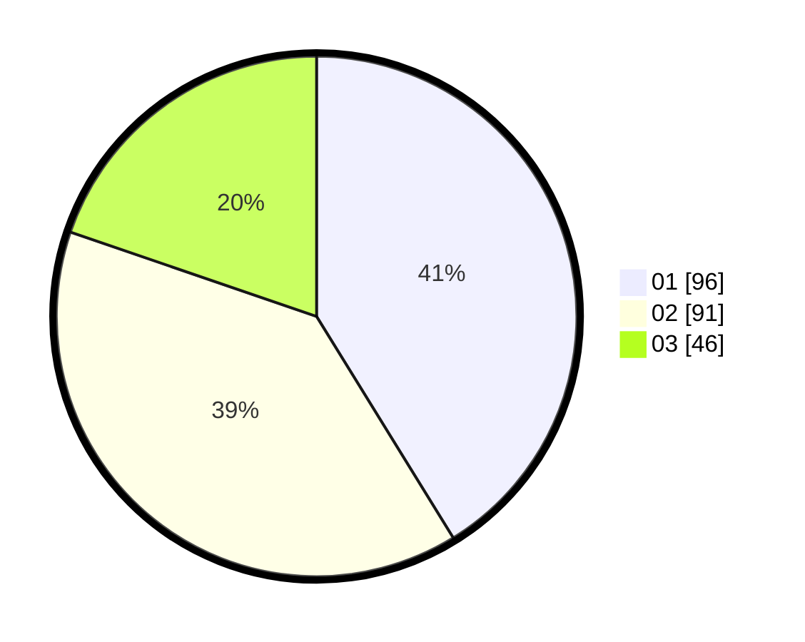

# Hasil

Hasil perolehan suara paslon dapat dilihat pada file paslon-01.txt, paslon-02.txt, dan paslon-03.txt.

Jika tidak ada, artinya data tersebut belum ada pada SIREKAP.

## Perolehan Suara

 * Paslon 01: **96**.
 * Paslon 02: **91**.
 * Paslon 03: **46**.

## Foto C Plano

https://sirekap-obj-formc.kpu.go.id/17be/pemilu/ppwp/31/75/08/10/01/3175081001043-20240215-000409--75a17a75-768c-44ce-91a6-e16d1b3fb3f1.jpg

https://sirekap-obj-formc.kpu.go.id/17be/pemilu/ppwp/31/75/08/10/01/3175081001043-20240215-000608--19da9355-ea33-4000-9eb2-04a891ca2876.jpg

https://sirekap-obj-formc.kpu.go.id/17be/pemilu/ppwp/31/75/08/10/01/3175081001043-20240215-000731--32db3d45-3ea5-4dd5-9c8f-471976b06fff.jpg
