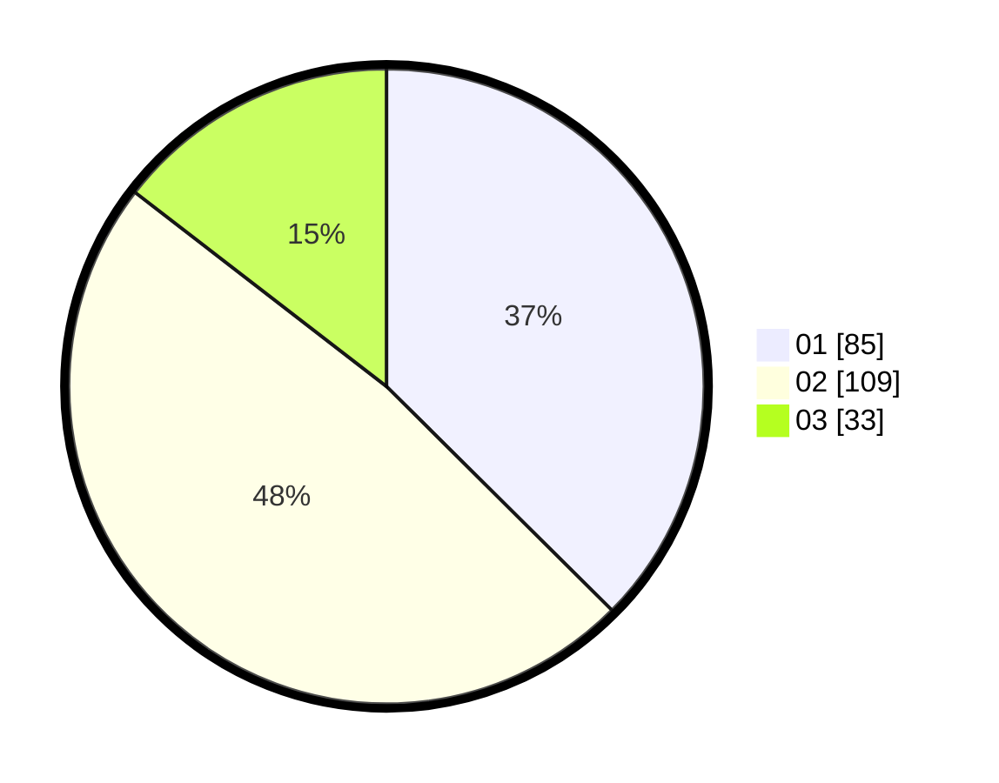

# Hasil

Hasil perolehan suara paslon dapat dilihat pada file paslon-01.txt, paslon-02.txt, dan paslon-03.txt.

Jika tidak ada, artinya data tersebut belum ada pada SIREKAP.

## Perolehan Suara

 * Paslon 01: **85**.
 * Paslon 02: **109**.
 * Paslon 03: **33**.

## Foto C Plano

https://sirekap-obj-formc.kpu.go.id/b87f/pemilu/ppwp/31/75/08/10/01/3175081001054-20240214-190503--b3eb3924-3a63-48a4-a05b-d033bc713517.jpg

https://sirekap-obj-formc.kpu.go.id/b87f/pemilu/ppwp/31/75/08/10/01/3175081001054-20240214-190644--6ed02e5c-400d-4caf-9701-4c2ea2f1cfdb.jpg

https://sirekap-obj-formc.kpu.go.id/b87f/pemilu/ppwp/31/75/08/10/01/3175081001054-20240214-190847--e9890d9a-6c52-4142-8758-65d37d0af54c.jpg

## DATA PEMILIH TETAP

Jumlah pemilih dalam DPT: **274**.
 * L: **133**.
 * P: **141**.

## DATA PENGGUNA HAK PILIH

Jumlah pengguna hak pilih dalam DPT: **222**.
 * L: **104**.
 * P: **118**.

Jumlah pengguna hak pilih dalam DPTb: **0**.
 * L: **0**.
 * P: **0**.

Jumlah pengguna hak pilih dalam DPK: **6**.
 * L: **1**.
 * P: **5**.

Jumlah pengguna hak pilih: **228**.
 * L: **105**.
 * P: **123**.

## JUMLAH SUARA SAH DAN TIDAK SAH

JUMLAH SELURUH SUARA SAH: **227**.

JUMLAH SUARA TIDAK SAH: **1**.

JUMLAH SELURUH SUARA SAH DAN SUARA TIDAK SAH: **228**.
