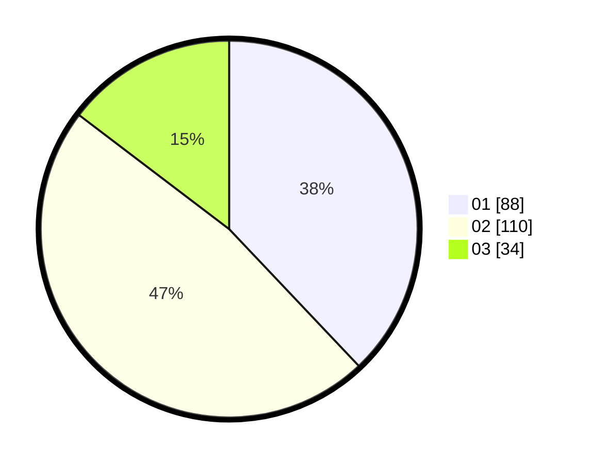

# Hasil

Hasil perolehan suara paslon dapat dilihat pada file paslon-01.txt, paslon-02.txt, dan paslon-03.txt.

Jika tidak ada, artinya data tersebut belum ada pada SIREKAP.

## Perolehan Suara

 * Paslon 01: **88**.
 * Paslon 02: **110**.
 * Paslon 03: **34**.

## Foto C Plano

https://sirekap-obj-formc.kpu.go.id/2ada/pemilu/ppwp/31/75/08/10/01/3175081001056-20240214-190204--e05500c4-5337-465d-9957-8c07192406c5.jpg

https://sirekap-obj-formc.kpu.go.id/2ada/pemilu/ppwp/31/75/08/10/01/3175081001056-20240214-190230--d1f522a1-c9fd-45c2-90b7-083bea63cde7.jpg

https://sirekap-obj-formc.kpu.go.id/2ada/pemilu/ppwp/31/75/08/10/01/3175081001056-20240214-190310--91294a67-2691-4ab2-8d83-632a294bdaf1.jpg
