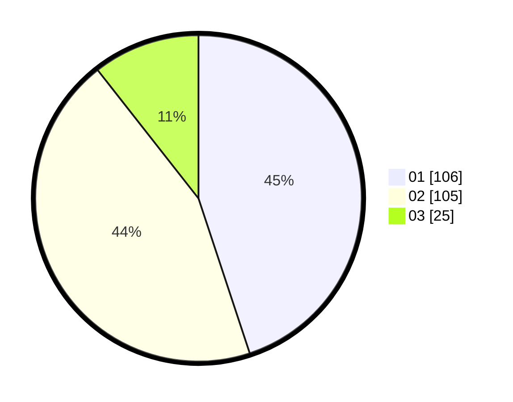

# Hasil

Hasil perolehan suara paslon dapat dilihat pada file paslon-01.txt, paslon-02.txt, dan paslon-03.txt.

Jika tidak ada, artinya data tersebut belum ada pada SIREKAP.

## Perolehan Suara

 * Paslon 01: **106**.
 * Paslon 02: **105**.
 * Paslon 03: **25**.

## Foto C Plano

https://sirekap-obj-formc.kpu.go.id/ed2a/pemilu/ppwp/31/75/08/10/01/3175081001057-20240214-190754--95c6289f-c75e-4801-8acd-0f4fdd0724dc.jpg

https://sirekap-obj-formc.kpu.go.id/ed2a/pemilu/ppwp/31/75/08/10/01/3175081001057-20240214-190958--b0faa9f0-f30e-449b-828f-18d1e23a3cf9.jpg

https://sirekap-obj-formc.kpu.go.id/ed2a/pemilu/ppwp/31/75/08/10/01/3175081001057-20240214-191145--47ecb3ab-365a-45fd-a155-c40aba7b5592.jpg

## DATA PEMILIH TETAP

Jumlah pemilih dalam DPT: **272**.
 * L: **132**.
 * P: **140**.

## DATA PENGGUNA HAK PILIH

Jumlah pengguna hak pilih dalam DPT: **234**.
 * L: **111**.
 * P: **123**.

Jumlah pengguna hak pilih dalam DPTb: **6**.
 * L: **2**.
 * P: **4**.

Jumlah pengguna hak pilih dalam DPK: **0**.
 * L: **0**.
 * P: **0**.

Jumlah pengguna hak pilih: **240**.
 * L: **113**.
 * P: **127**.

## JUMLAH SUARA SAH DAN TIDAK SAH

JUMLAH SELURUH SUARA SAH: **236**.

JUMLAH SUARA TIDAK SAH: **4**.

JUMLAH SELURUH SUARA SAH DAN SUARA TIDAK SAH: **240**.
