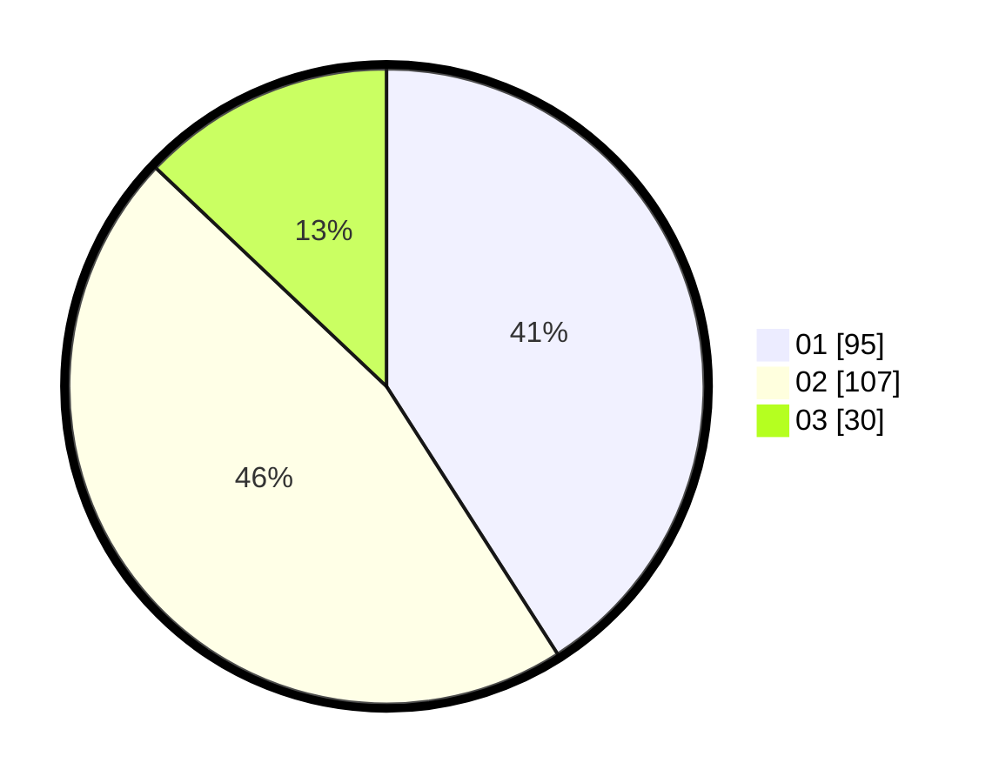

# Hasil

Hasil perolehan suara paslon dapat dilihat pada file paslon-01.txt, paslon-02.txt, dan paslon-03.txt.

Jika tidak ada, artinya data tersebut belum ada pada SIREKAP.

## Perolehan Suara

 * Paslon 01: **95**.
 * Paslon 02: **107**.
 * Paslon 03: **30**.

## Foto C Plano

https://sirekap-obj-formc.kpu.go.id/db85/pemilu/ppwp/31/75/08/10/01/3175081001058-20240214-210813--10498054-8b4e-413b-bf5d-345dcdac1cdc.jpg

https://sirekap-obj-formc.kpu.go.id/db85/pemilu/ppwp/31/75/08/10/01/3175081001058-20240214-211653--fb70706c-ef33-4f1b-ac2b-9343359d3078.jpg

https://sirekap-obj-formc.kpu.go.id/db85/pemilu/ppwp/31/75/08/10/01/3175081001058-20240214-211749--86d937de-8f3c-4be4-b3ff-37638b37ca12.jpg

## DATA PEMILIH TETAP

Jumlah pemilih dalam DPT: **279**.
 * L: **126**.
 * P: **153**.

## DATA PENGGUNA HAK PILIH

Jumlah pengguna hak pilih dalam DPT: **239**.
 * L: **96**.
 * P: **143**.

Jumlah pengguna hak pilih dalam DPTb: **0**.
 * L: **0**.
 * P: **0**.

Jumlah pengguna hak pilih dalam DPK: **3**.
 * L: **2**.
 * P: **1**.

Jumlah pengguna hak pilih: **242**.
 * L: **98**.
 * P: **144**.

## JUMLAH SUARA SAH DAN TIDAK SAH

JUMLAH SELURUH SUARA SAH: **232**.

JUMLAH SUARA TIDAK SAH: **10**.

JUMLAH SELURUH SUARA SAH DAN SUARA TIDAK SAH: **242**.
