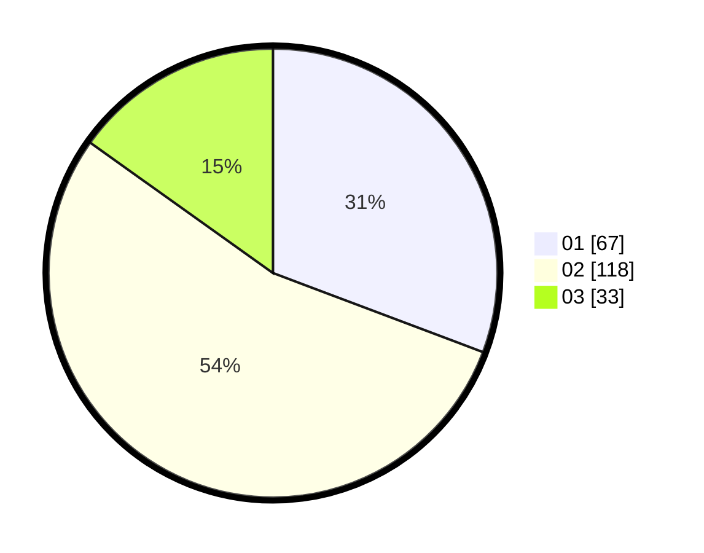

# Hasil

Hasil perolehan suara paslon dapat dilihat pada file paslon-01.txt, paslon-02.txt, dan paslon-03.txt.

Jika tidak ada, artinya data tersebut belum ada pada SIREKAP.

## Perolehan Suara

 * Paslon 01: **67**.
 * Paslon 02: **118**.
 * Paslon 03: **33**.

## Foto C Plano

https://sirekap-obj-formc.kpu.go.id/1c62/pemilu/ppwp/31/75/08/10/01/3175081001061-20240214-205803--82e2b78d-acec-4365-a4f3-4112f5f1bffd.jpg

https://sirekap-obj-formc.kpu.go.id/1c62/pemilu/ppwp/31/75/08/10/01/3175081001061-20240214-205621--a67e9477-da22-43b4-a4f8-cbc68aec5051.jpg

https://sirekap-obj-formc.kpu.go.id/1c62/pemilu/ppwp/31/75/08/10/01/3175081001061-20240214-232054--413bddb2-ff99-45e5-9090-794bac06bf7a.jpg
