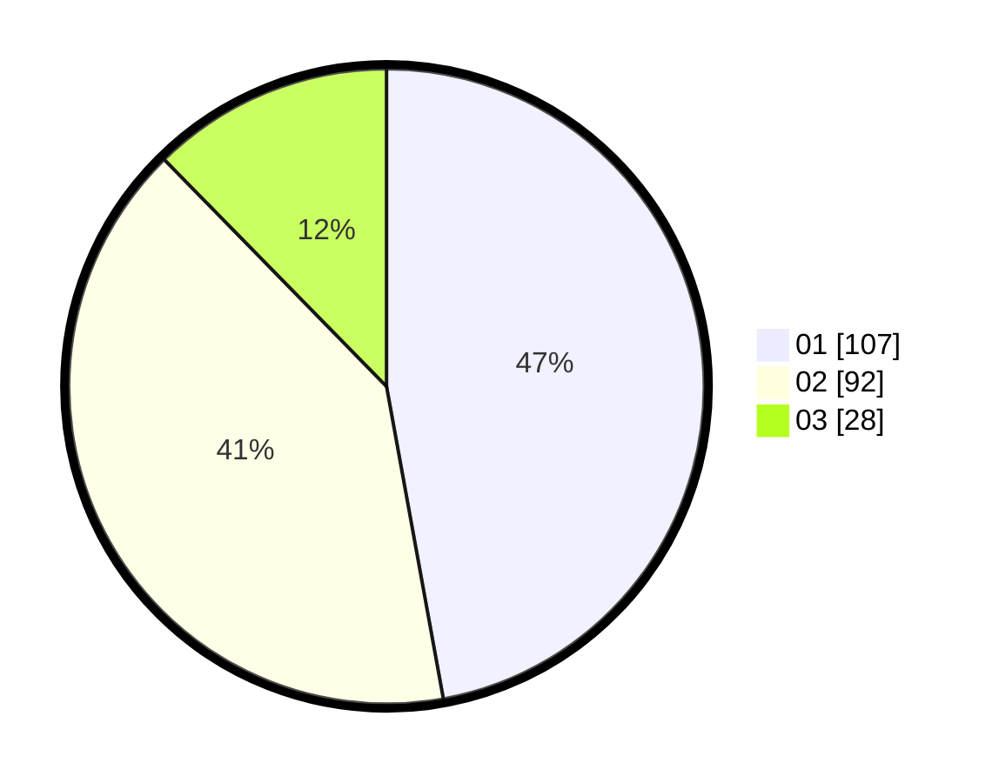

# Hasil

Hasil perolehan suara paslon dapat dilihat pada file paslon-01.txt, paslon-02.txt, dan paslon-03.txt.

Jika tidak ada, artinya data tersebut belum ada pada SIREKAP.

## Perolehan Suara

 * Paslon 01: **107**.
 * Paslon 02: **92**.
 * Paslon 03: **28**.

## Foto C Plano

https://sirekap-obj-formc.kpu.go.id/26d5/pemilu/ppwp/31/75/08/10/01/3175081001064-20240215-230719--f4c0395d-4ccb-413d-8b31-20b14d1e3a76.jpg

https://sirekap-obj-formc.kpu.go.id/26d5/pemilu/ppwp/31/75/08/10/01/3175081001064-20240215-230720--b5d81e73-0989-4c90-839b-424530d87230.jpg

https://sirekap-obj-formc.kpu.go.id/26d5/pemilu/ppwp/31/75/08/10/01/3175081001064-20240215-230719--0b1abea8-6edf-4ffc-85b2-ff5a4223b1b7.jpg

## DATA PEMILIH TETAP

Jumlah pemilih dalam DPT: **268**.
 * L: **128**.
 * P: **140**.

## DATA PENGGUNA HAK PILIH

Jumlah pengguna hak pilih dalam DPT: **229**.
 * L: **109**.
 * P: **120**.

Jumlah pengguna hak pilih dalam DPTb: **0**.
 * L: **0**.
 * P: **0**.

Jumlah pengguna hak pilih dalam DPK: **1**.
 * L: **0**.
 * P: **1**.

Jumlah pengguna hak pilih: **230**.
 * L: **109**.
 * P: **121**.

## JUMLAH SUARA SAH DAN TIDAK SAH

JUMLAH SELURUH SUARA SAH: **227**.

JUMLAH SUARA TIDAK SAH: **3**.

JUMLAH SELURUH SUARA SAH DAN SUARA TIDAK SAH: **230**.
