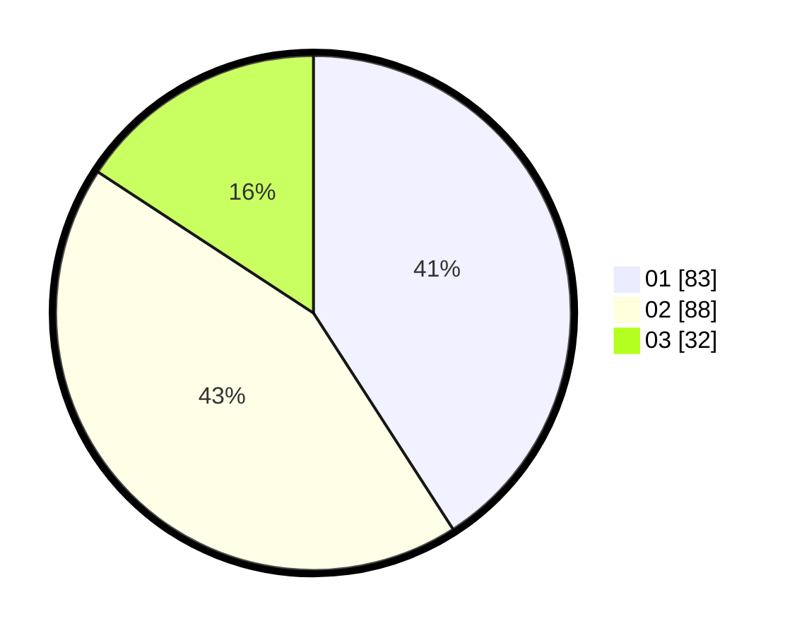

# Hasil

Hasil perolehan suara paslon dapat dilihat pada file paslon-01.txt, paslon-02.txt, dan paslon-03.txt.

Jika tidak ada, artinya data tersebut belum ada pada SIREKAP.

## Perolehan Suara

 * Paslon 01: **83**.
 * Paslon 02: **88**.
 * Paslon 03: **32**.

## Foto C Plano

https://sirekap-obj-formc.kpu.go.id/b69d/pemilu/ppwp/31/75/08/10/01/3175081001066-20240214-185203--cb0a32ce-d462-4488-947e-360a43c079c3.jpg

https://sirekap-obj-formc.kpu.go.id/b69d/pemilu/ppwp/31/75/08/10/01/3175081001066-20240214-190512--e7b916ec-1fd8-4a43-95a6-d4812542c3c3.jpg

https://sirekap-obj-formc.kpu.go.id/b69d/pemilu/ppwp/31/75/08/10/01/3175081001066-20240214-190344--b1e17e56-f435-42c4-92c3-788590be6b6f.jpg

## DATA PEMILIH TETAP

Jumlah pemilih dalam DPT: **283**.
 * L: **135**.
 * P: **148**.

## DATA PENGGUNA HAK PILIH

Jumlah pengguna hak pilih dalam DPT: **205**.
 * L: **90**.
 * P: **115**.

Jumlah pengguna hak pilih dalam DPTb: **0**.
 * L: **0**.
 * P: **0**.

Jumlah pengguna hak pilih dalam DPK: **0**.
 * L: **0**.
 * P: **0**.

Jumlah pengguna hak pilih: **205**.
 * L: **90**.
 * P: **115**.

## JUMLAH SUARA SAH DAN TIDAK SAH

JUMLAH SELURUH SUARA SAH: **203**.

JUMLAH SUARA TIDAK SAH: **2**.

JUMLAH SELURUH SUARA SAH DAN SUARA TIDAK SAH: **205**.
