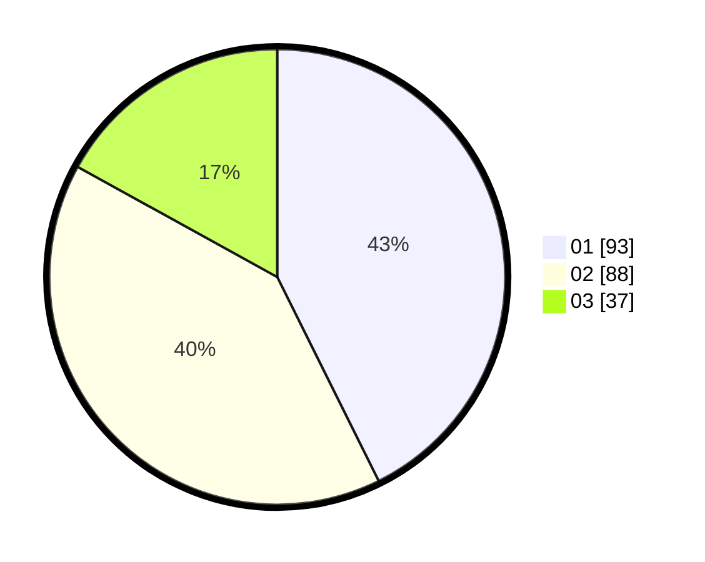

# Hasil

Hasil perolehan suara paslon dapat dilihat pada file paslon-01.txt, paslon-02.txt, dan paslon-03.txt.

Jika tidak ada, artinya data tersebut belum ada pada SIREKAP.

## Perolehan Suara

 * Paslon 01: **93**.
 * Paslon 02: **88**.
 * Paslon 03: **37**.

## Foto C Plano

https://sirekap-obj-formc.kpu.go.id/14b8/pemilu/ppwp/31/75/08/10/01/3175081001067-20240214-155812--d99e0c6e-db24-4fb2-b468-d35043edd523.jpg

https://sirekap-obj-formc.kpu.go.id/14b8/pemilu/ppwp/31/75/08/10/01/3175081001067-20240214-160117--59f5056f-a827-44f6-afab-d19fe6dc7a5e.jpg

https://sirekap-obj-formc.kpu.go.id/14b8/pemilu/ppwp/31/75/08/10/01/3175081001067-20240214-155310--afd2440a-b2b4-4d8c-8e1c-af98d201b698.jpg

## DATA PEMILIH TETAP

Jumlah pemilih dalam DPT: **280**.
 * L: **139**.
 * P: **141**.

## DATA PENGGUNA HAK PILIH

Jumlah pengguna hak pilih dalam DPT: **219**.
 * L: **102**.
 * P: **117**.

Jumlah pengguna hak pilih dalam DPTb: **0**.
 * L: **0**.
 * P: **0**.

Jumlah pengguna hak pilih dalam DPK: **0**.
 * L: **0**.
 * P: **0**.

Jumlah pengguna hak pilih: **219**.
 * L: **102**.
 * P: **117**.

## JUMLAH SUARA SAH DAN TIDAK SAH

JUMLAH SELURUH SUARA SAH: **218**.

JUMLAH SUARA TIDAK SAH: **1**.

JUMLAH SELURUH SUARA SAH DAN SUARA TIDAK SAH: **219**.
