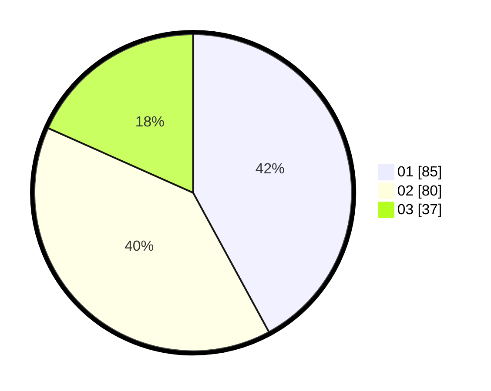

# Hasil

Hasil perolehan suara paslon dapat dilihat pada file paslon-01.txt, paslon-02.txt, dan paslon-03.txt.

Jika tidak ada, artinya data tersebut belum ada pada SIREKAP.

## Perolehan Suara

 * Paslon 01: **85**.
 * Paslon 02: **80**.
 * Paslon 03: **37**.

## Foto C Plano

https://sirekap-obj-formc.kpu.go.id/2492/pemilu/ppwp/31/75/08/10/01/3175081001082-20240215-004320--1abdbca7-5df8-4a04-87f3-d2ec8d84e98d.jpg

https://sirekap-obj-formc.kpu.go.id/2492/pemilu/ppwp/31/75/08/10/01/3175081001082-20240215-004405--d7ecfab3-5fc9-4705-b7b8-7bd090575bda.jpg

https://sirekap-obj-formc.kpu.go.id/2492/pemilu/ppwp/31/75/08/10/01/3175081001082-20240215-004441--6ec9f134-fbe7-442c-a88d-54b76eb6af8f.jpg
