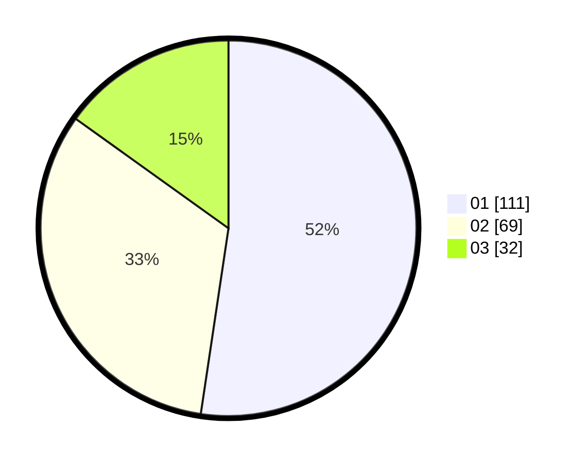

# Hasil

Hasil perolehan suara paslon dapat dilihat pada file paslon-01.txt, paslon-02.txt, dan paslon-03.txt.

Jika tidak ada, artinya data tersebut belum ada pada SIREKAP.

## Perolehan Suara

 * Paslon 01: **111**.
 * Paslon 02: **69**.
 * Paslon 03: **32**.

## Foto C Plano

https://sirekap-obj-formc.kpu.go.id/cb9e/pemilu/ppwp/31/75/08/10/01/3175081001083-20240215-234349--f505a363-e5d2-4a6f-8b63-381d97eb0ce1.jpg

https://sirekap-obj-formc.kpu.go.id/cb9e/pemilu/ppwp/31/75/08/10/01/3175081001083-20240215-234352--aad31d85-f837-46a3-ad2e-f894d4498381.jpg

https://sirekap-obj-formc.kpu.go.id/cb9e/pemilu/ppwp/31/75/08/10/01/3175081001083-20240215-234350--c745f66c-6d75-4a34-8815-bb6ac2a7f721.jpg

## DATA PEMILIH TETAP

Jumlah pemilih dalam DPT: **251**.
 * L: **125**.
 * P: **126**.

## DATA PENGGUNA HAK PILIH

Jumlah pengguna hak pilih dalam DPT: **214**.
 * L: **102**.
 * P: **112**.

Jumlah pengguna hak pilih dalam DPTb: **0**.
 * L: **0**.
 * P: **0**.

Jumlah pengguna hak pilih dalam DPK: **1**.
 * L: **0**.
 * P: **1**.

Jumlah pengguna hak pilih: **215**.
 * L: **102**.
 * P: **113**.

## JUMLAH SUARA SAH DAN TIDAK SAH

JUMLAH SELURUH SUARA SAH: **212**.

JUMLAH SUARA TIDAK SAH: **3**.

JUMLAH SELURUH SUARA SAH DAN SUARA TIDAK SAH: **215**.
