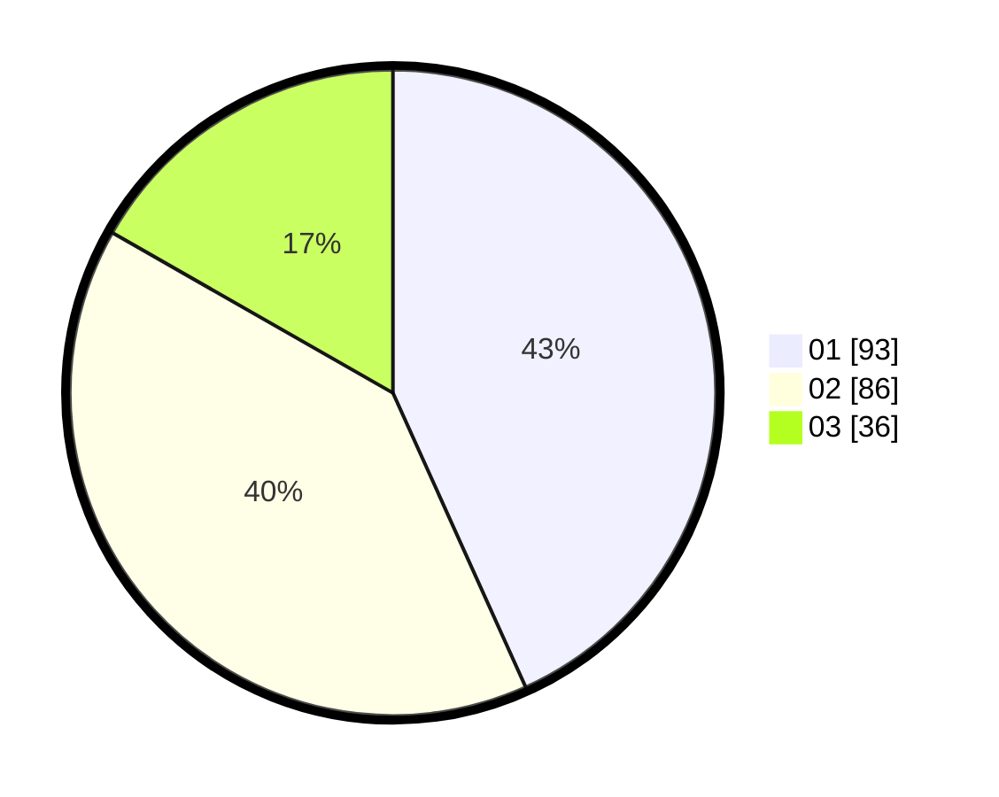

# Hasil

Hasil perolehan suara paslon dapat dilihat pada file paslon-01.txt, paslon-02.txt, dan paslon-03.txt.

Jika tidak ada, artinya data tersebut belum ada pada SIREKAP.

## Perolehan Suara

 * Paslon 01: **93**.
 * Paslon 02: **86**.
 * Paslon 03: **36**.

## Foto C Plano

https://sirekap-obj-formc.kpu.go.id/465f/pemilu/ppwp/31/75/08/10/01/3175081001085-20240216-042626--0d390a8b-c1d0-4deb-b240-b7b8d45a1efa.jpg

https://sirekap-obj-formc.kpu.go.id/465f/pemilu/ppwp/31/75/08/10/01/3175081001085-20240216-042628--c4d3624e-f252-4906-922a-0070077b3afe.jpg

https://sirekap-obj-formc.kpu.go.id/465f/pemilu/ppwp/31/75/08/10/01/3175081001085-20240216-042627--931825d2-1361-497b-96fb-827c12feef43.jpg

## DATA PEMILIH TETAP

Jumlah pemilih dalam DPT: **271**.
 * L: **133**.
 * P: **138**.

## DATA PENGGUNA HAK PILIH

Jumlah pengguna hak pilih dalam DPT: **214**.
 * L: **103**.
 * P: **111**.

Jumlah pengguna hak pilih dalam DPTb: **2**.
 * L: **1**.
 * P: **1**.

Jumlah pengguna hak pilih dalam DPK: **1**.
 * L: **0**.
 * P: **1**.

Jumlah pengguna hak pilih: **217**.
 * L: **104**.
 * P: **123**.

## JUMLAH SUARA SAH DAN TIDAK SAH

JUMLAH SELURUH SUARA SAH: **215**.

JUMLAH SUARA TIDAK SAH: **2**.

JUMLAH SELURUH SUARA SAH DAN SUARA TIDAK SAH: **217**.
