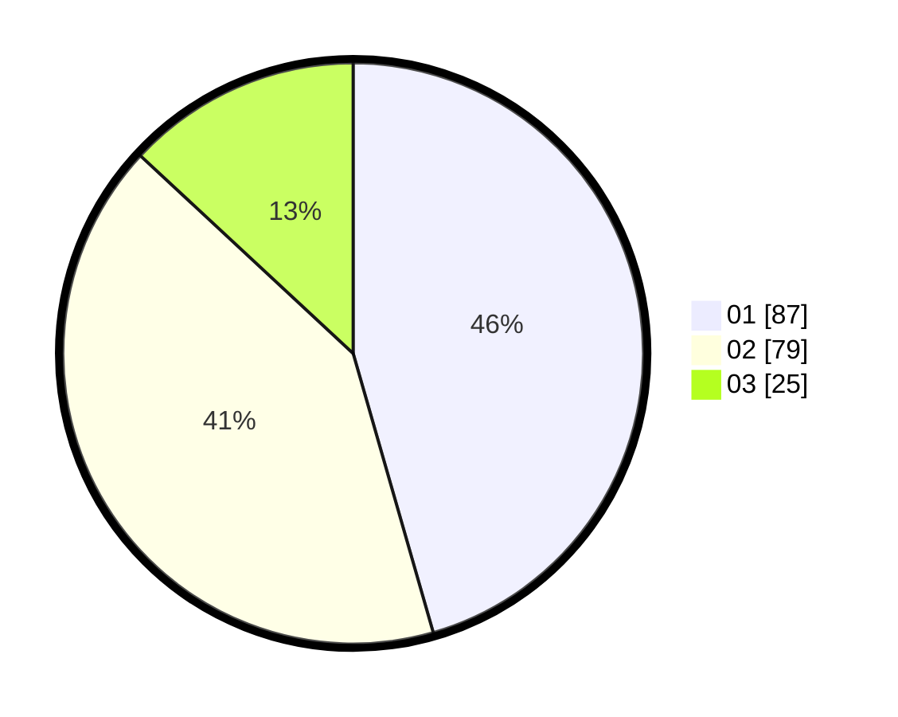

# Hasil

Hasil perolehan suara paslon dapat dilihat pada file paslon-01.txt, paslon-02.txt, dan paslon-03.txt.

Jika tidak ada, artinya data tersebut belum ada pada SIREKAP.

## Perolehan Suara

 * Paslon 01: **87**.
 * Paslon 02: **79**.
 * Paslon 03: **25**.

## Foto C Plano

https://sirekap-obj-formc.kpu.go.id/bef0/pemilu/ppwp/31/75/08/10/01/3175081001088-20240215-012632--104545ab-d00f-444e-842e-8bc1d022aa68.jpg

https://sirekap-obj-formc.kpu.go.id/bef0/pemilu/ppwp/31/75/08/10/01/3175081001088-20240215-012804--633a0b73-6b61-4b02-af46-ab710733ba2c.jpg

https://sirekap-obj-formc.kpu.go.id/bef0/pemilu/ppwp/31/75/08/10/01/3175081001088-20240215-012934--2e23595c-3bea-4dff-a635-9a7dc0de0dec.jpg
