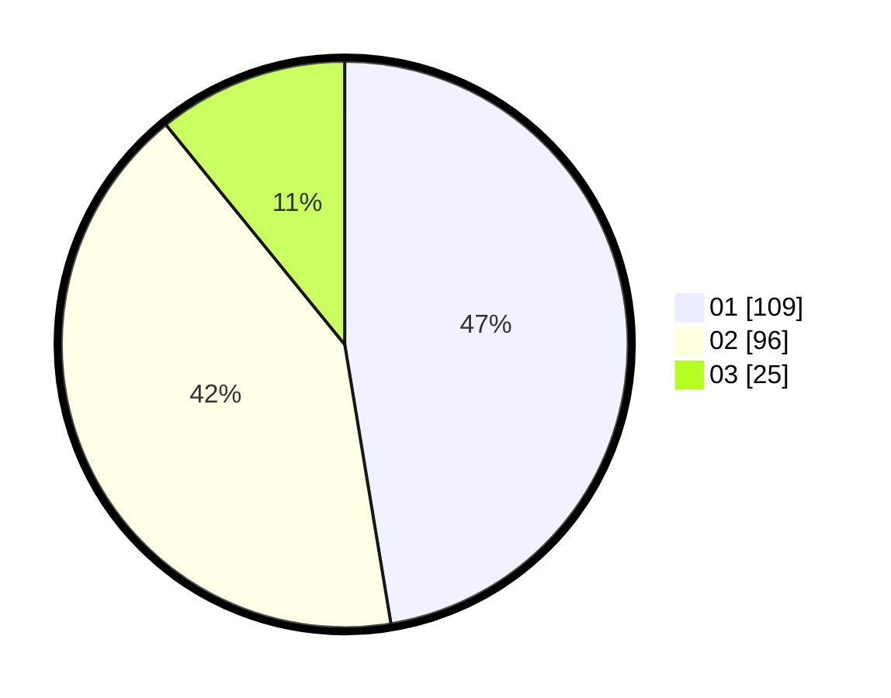

# Hasil

Hasil perolehan suara paslon dapat dilihat pada file paslon-01.txt, paslon-02.txt, dan paslon-03.txt.

Jika tidak ada, artinya data tersebut belum ada pada SIREKAP.

## Perolehan Suara

 * Paslon 01: **109**.
 * Paslon 02: **96**.
 * Paslon 03: **25**.

## Foto C Plano

https://sirekap-obj-formc.kpu.go.id/548c/pemilu/ppwp/31/75/08/10/01/3175081001092-20240214-155552--b2734df9-e43d-4936-ab44-6174f4f7c41d.jpg

https://sirekap-obj-formc.kpu.go.id/548c/pemilu/ppwp/31/75/08/10/01/3175081001092-20240214-155219--0d7ea0b0-36ef-4f01-8927-840a8a709efe.jpg

https://sirekap-obj-formc.kpu.go.id/548c/pemilu/ppwp/31/75/08/10/01/3175081001092-20240214-155247--01155300-949e-46b8-80ef-eab6cc8fd3a0.jpg

## DATA PEMILIH TETAP

Jumlah pemilih dalam DPT: **275**.
 * L: **141**.
 * P: **134**.

## DATA PENGGUNA HAK PILIH

Jumlah pengguna hak pilih dalam DPT: **231**.
 * L: **116**.
 * P: **115**.

Jumlah pengguna hak pilih dalam DPTb: **0**.
 * L: **0**.
 * P: **0**.

Jumlah pengguna hak pilih dalam DPK: **1**.
 * L: **0**.
 * P: **1**.

Jumlah pengguna hak pilih: **232**.
 * L: **116**.
 * P: **116**.

## JUMLAH SUARA SAH DAN TIDAK SAH

JUMLAH SELURUH SUARA SAH: **230**.

JUMLAH SUARA TIDAK SAH: **2**.

JUMLAH SELURUH SUARA SAH DAN SUARA TIDAK SAH: **232**.
