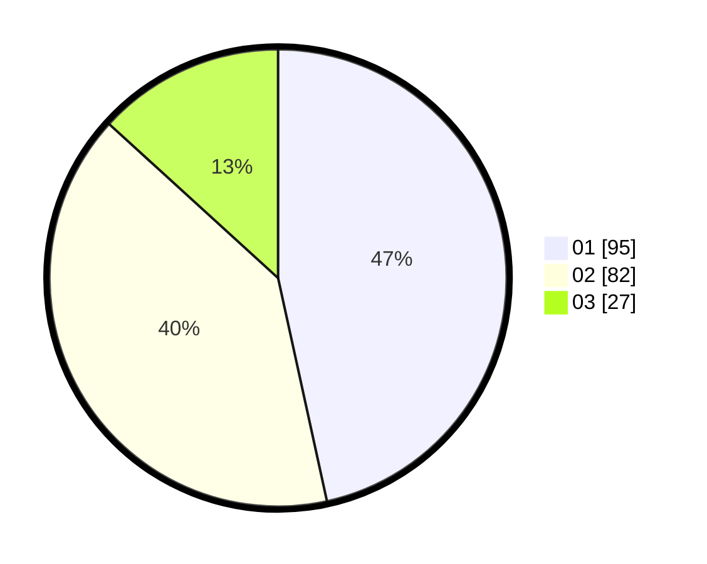

# Hasil

Hasil perolehan suara paslon dapat dilihat pada file paslon-01.txt, paslon-02.txt, dan paslon-03.txt.

Jika tidak ada, artinya data tersebut belum ada pada SIREKAP.

## Perolehan Suara

 * Paslon 01: **95**.
 * Paslon 02: **82**.
 * Paslon 03: **27**.

## Foto C Plano

https://sirekap-obj-formc.kpu.go.id/8543/pemilu/ppwp/31/75/08/10/01/3175081001093-20240214-234355--da0f844b-020c-4492-b3bf-1df57ec5ca9b.jpg

https://sirekap-obj-formc.kpu.go.id/8543/pemilu/ppwp/31/75/08/10/01/3175081001093-20240214-234507--4ba51e17-cb1a-4957-b26b-bcfca5931041.jpg

https://sirekap-obj-formc.kpu.go.id/8543/pemilu/ppwp/31/75/08/10/01/3175081001093-20240214-234559--a5135fa6-b27f-4e0b-b03e-1371fbf1e82a.jpg
