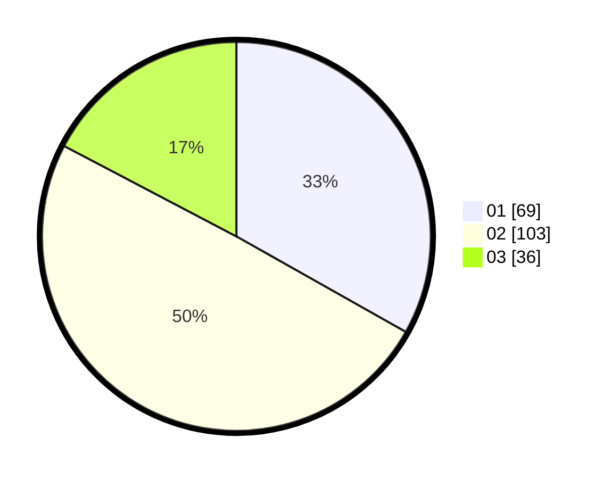

# Hasil

Hasil perolehan suara paslon dapat dilihat pada file paslon-01.txt, paslon-02.txt, dan paslon-03.txt.

Jika tidak ada, artinya data tersebut belum ada pada SIREKAP.

## Perolehan Suara

 * Paslon 01: **69**.
 * Paslon 02: **103**.
 * Paslon 03: **36**.

## Foto C Plano

https://sirekap-obj-formc.kpu.go.id/1ef0/pemilu/ppwp/31/75/08/10/01/3175081001095-20240214-185825--e7e20c89-dd7d-45bf-8978-414ce522d4bc.jpg

https://sirekap-obj-formc.kpu.go.id/1ef0/pemilu/ppwp/31/75/08/10/01/3175081001095-20240214-190716--97c40e2b-e149-4b4f-8f12-6f82d523de01.jpg

https://sirekap-obj-formc.kpu.go.id/1ef0/pemilu/ppwp/31/75/08/10/01/3175081001095-20240214-190304--da6d53b7-3371-4fd8-b4e5-1d9394887bc8.jpg

## DATA PEMILIH TETAP

Jumlah pemilih dalam DPT: **259**.
 * L: **129**.
 * P: **130**.

## DATA PENGGUNA HAK PILIH

Jumlah pengguna hak pilih dalam DPT: **210**.
 * L: **109**.
 * P: **101**.

Jumlah pengguna hak pilih dalam DPTb: **0**.
 * L: **0**.
 * P: **0**.

Jumlah pengguna hak pilih dalam DPK: **0**.
 * L: **0**.
 * P: **0**.

Jumlah pengguna hak pilih: **210**.
 * L: **109**.
 * P: **101**.

## JUMLAH SUARA SAH DAN TIDAK SAH

JUMLAH SELURUH SUARA SAH: **208**.

JUMLAH SUARA TIDAK SAH: **2**.

JUMLAH SELURUH SUARA SAH DAN SUARA TIDAK SAH: **210**.
