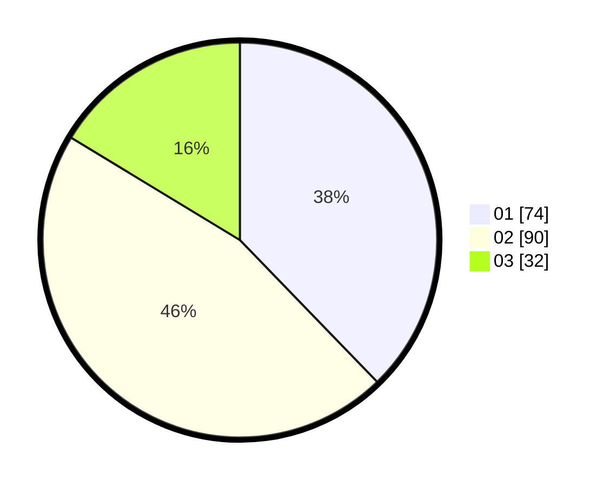

# Hasil

Hasil perolehan suara paslon dapat dilihat pada file paslon-01.txt, paslon-02.txt, dan paslon-03.txt.

Jika tidak ada, artinya data tersebut belum ada pada SIREKAP.

## Perolehan Suara

 * Paslon 01: **74**.
 * Paslon 02: **90**.
 * Paslon 03: **32**.

## Foto C Plano

https://sirekap-obj-formc.kpu.go.id/f142/pemilu/ppwp/31/75/08/10/01/3175081001096-20240214-204508--ef219415-5199-424d-bf67-6149febf180a.jpg

https://sirekap-obj-formc.kpu.go.id/f142/pemilu/ppwp/31/75/08/10/01/3175081001096-20240214-204527--4e97c04a-abed-4d5c-a85d-2c8e95b2fe53.jpg

https://sirekap-obj-formc.kpu.go.id/f142/pemilu/ppwp/31/75/08/10/01/3175081001096-20240214-204543--40f04006-9cf0-4c56-a551-6839b6b16477.jpg
