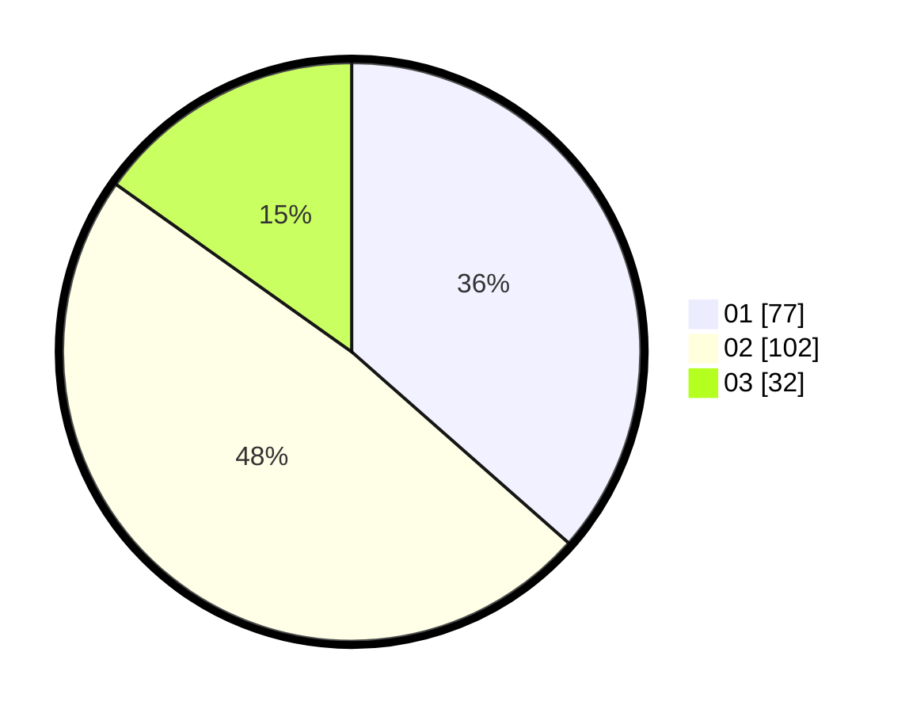

# Hasil

Hasil perolehan suara paslon dapat dilihat pada file paslon-01.txt, paslon-02.txt, dan paslon-03.txt.

Jika tidak ada, artinya data tersebut belum ada pada SIREKAP.

## Perolehan Suara

 * Paslon 01: **77**.
 * Paslon 02: **102**.
 * Paslon 03: **32**.

## Foto C Plano

https://sirekap-obj-formc.kpu.go.id/b0c0/pemilu/ppwp/31/75/08/10/01/3175081001098-20240216-031331--9ff31a8a-6a70-4dfd-8870-27f20c8612ca.jpg

https://sirekap-obj-formc.kpu.go.id/b0c0/pemilu/ppwp/31/75/08/10/01/3175081001098-20240216-031333--75352b41-0eff-4e39-98e2-3756b8248d4a.jpg

https://sirekap-obj-formc.kpu.go.id/b0c0/pemilu/ppwp/31/75/08/10/01/3175081001098-20240216-031332--2cb7f136-a2d4-4084-9d22-e98b5e56bf1e.jpg

## DATA PEMILIH TETAP

Jumlah pemilih dalam DPT: **262**.
 * L: **133**.
 * P: **129**.

## DATA PENGGUNA HAK PILIH

Jumlah pengguna hak pilih dalam DPT: **211**.
 * L: **104**.
 * P: **107**.

Jumlah pengguna hak pilih dalam DPTb: **2**.
 * L: **2**.
 * P: **0**.

Jumlah pengguna hak pilih dalam DPK: **2**.
 * L: **1**.
 * P: **1**.

Jumlah pengguna hak pilih: **215**.
 * L: **107**.
 * P: **108**.

## JUMLAH SUARA SAH DAN TIDAK SAH

JUMLAH SELURUH SUARA SAH: **211**.

JUMLAH SUARA TIDAK SAH: **4**.

JUMLAH SELURUH SUARA SAH DAN SUARA TIDAK SAH: **215**.
