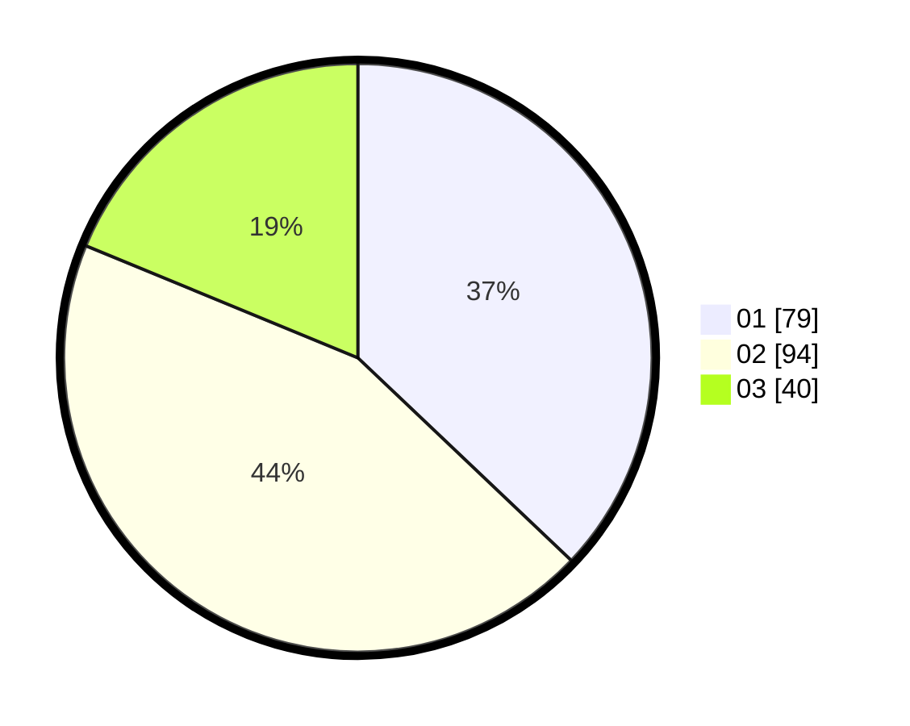

# Hasil

Hasil perolehan suara paslon dapat dilihat pada file paslon-01.txt, paslon-02.txt, dan paslon-03.txt.

Jika tidak ada, artinya data tersebut belum ada pada SIREKAP.

## Perolehan Suara

 * Paslon 01: **79**.
 * Paslon 02: **94**.
 * Paslon 03: **40**.

## Foto C Plano

https://sirekap-obj-formc.kpu.go.id/3f61/pemilu/ppwp/31/75/08/10/01/3175081001099-20240214-223437--22d37070-87df-4e6f-887e-b9c9f673a0a8.jpg

https://sirekap-obj-formc.kpu.go.id/3f61/pemilu/ppwp/31/75/08/10/01/3175081001099-20240214-223506--b6470079-7dad-4b90-a46b-dc498b90fbb7.jpg

https://sirekap-obj-formc.kpu.go.id/3f61/pemilu/ppwp/31/75/08/10/01/3175081001099-20240214-223526--b16e1452-2abe-45ea-a110-a0a982931166.jpg
