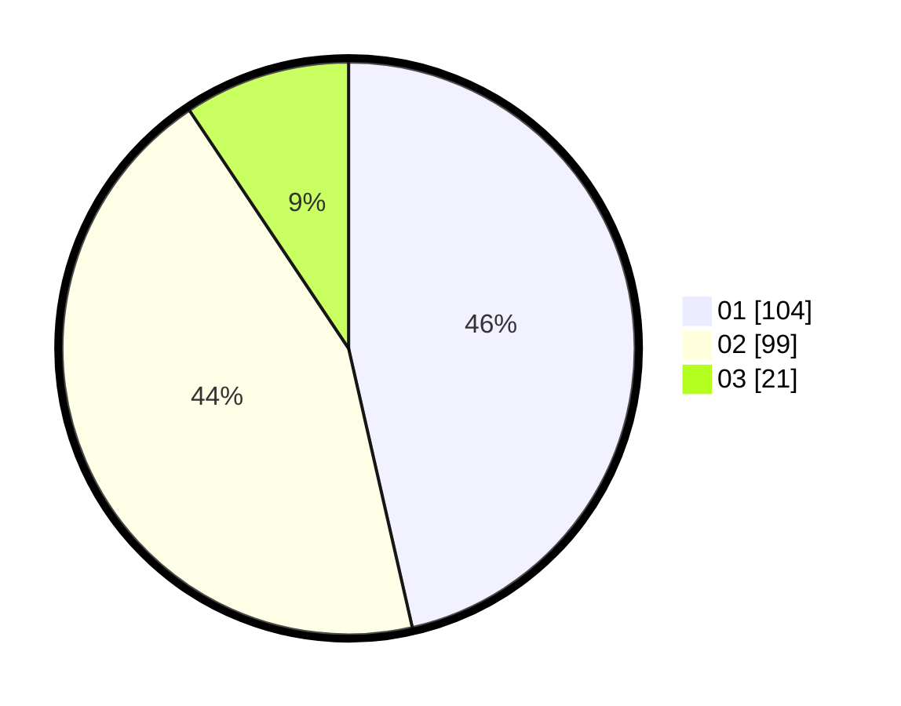

# Hasil

Hasil perolehan suara paslon dapat dilihat pada file paslon-01.txt, paslon-02.txt, dan paslon-03.txt.

Jika tidak ada, artinya data tersebut belum ada pada SIREKAP.

## Perolehan Suara

 * Paslon 01: **104**.
 * Paslon 02: **99**.
 * Paslon 03: **21**.

## Foto C Plano

https://sirekap-obj-formc.kpu.go.id/a17c/pemilu/ppwp/31/75/08/10/01/3175081001109-20240214-210203--b8e73d43-6a3b-4e26-b499-cacb82a779d8.jpg

https://sirekap-obj-formc.kpu.go.id/a17c/pemilu/ppwp/31/75/08/10/01/3175081001109-20240214-210210--844687f2-0e66-447f-b3f7-6602aba6c3a3.jpg

https://sirekap-obj-formc.kpu.go.id/a17c/pemilu/ppwp/31/75/08/10/01/3175081001109-20240214-210219--332fdb2d-9c5a-4c87-a218-3c5be0be22db.jpg
