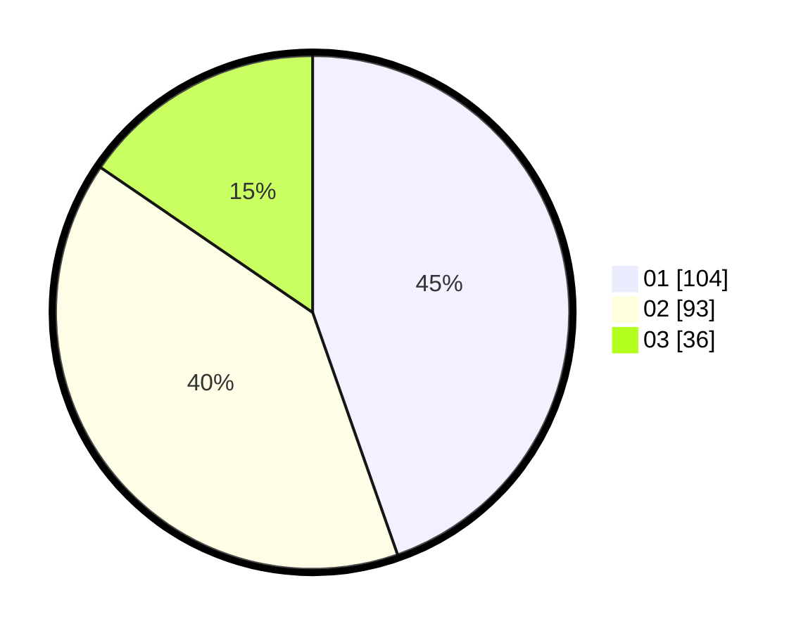

# Hasil

Hasil perolehan suara paslon dapat dilihat pada file paslon-01.txt, paslon-02.txt, dan paslon-03.txt.

Jika tidak ada, artinya data tersebut belum ada pada SIREKAP.

## Perolehan Suara

 * Paslon 01: **104**.
 * Paslon 02: **93**.
 * Paslon 03: **36**.

## Foto C Plano

https://sirekap-obj-formc.kpu.go.id/b00a/pemilu/ppwp/31/75/08/10/01/3175081001110-20240214-213727--d63989f8-0098-4a57-8b70-50f067bf51e2.jpg

https://sirekap-obj-formc.kpu.go.id/b00a/pemilu/ppwp/31/75/08/10/01/3175081001110-20240214-213727--681f7897-4661-43a4-af3b-e176af0b77ce.jpg

https://sirekap-obj-formc.kpu.go.id/b00a/pemilu/ppwp/31/75/08/10/01/3175081001110-20240214-203312--8cff14e8-aa1a-4fae-8eaa-6cd5cf1adcb8.jpg
