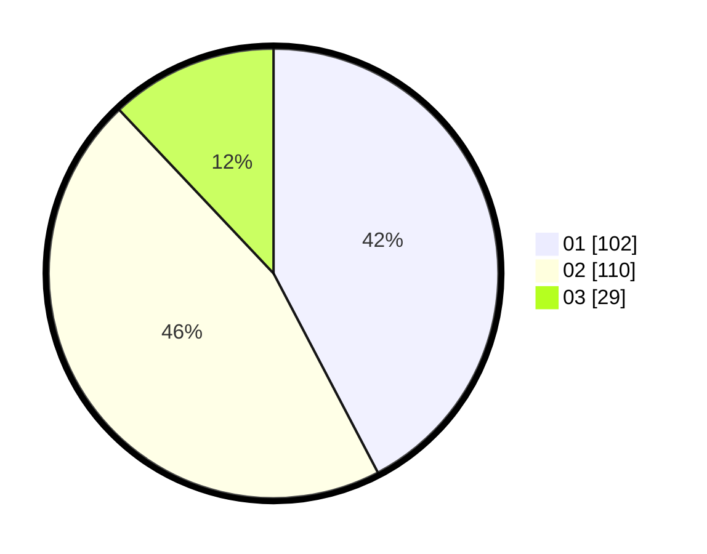

# Hasil

Hasil perolehan suara paslon dapat dilihat pada file paslon-01.txt, paslon-02.txt, dan paslon-03.txt.

Jika tidak ada, artinya data tersebut belum ada pada SIREKAP.

## Perolehan Suara

 * Paslon 01: **102**.
 * Paslon 02: **110**.
 * Paslon 03: **29**.

## Foto C Plano

https://sirekap-obj-formc.kpu.go.id/9cd6/pemilu/ppwp/31/75/08/10/01/3175081001114-20240214-185938--49edd511-b02e-4059-bae3-c6a0d5002a9b.jpg

https://sirekap-obj-formc.kpu.go.id/9cd6/pemilu/ppwp/31/75/08/10/01/3175081001114-20240214-185902--ba85ee52-43cf-405c-b659-74b55e2d0b04.jpg

https://sirekap-obj-formc.kpu.go.id/9cd6/pemilu/ppwp/31/75/08/10/01/3175081001114-20240214-190020--ac7464a5-6932-464c-8d55-d153a28ed740.jpg
